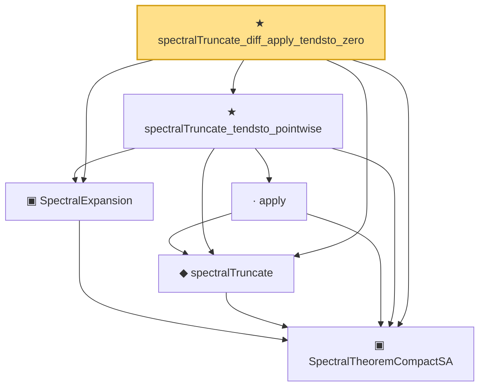

# Proof narrative — spectralTruncate_diff_apply_tendsto_zero

Root: **spectralTruncate_diff_apply_tendsto_zero** (theorem) `Statlib/Mathlib/Analysis/SpectralTruncationConv.lean:130` · topic `Mathlib`
Closure: 6 declarations across 3 files. Generated from `proof_graph.json` — no files were moved.

Reading order (foundations first, headline last):

  ▣ `SpectralTheoremCompactSA` — structure · `Statlib/Mathlib/Analysis/SpectralCompactSelfAdjoint.lean:299`  _(also used by 28: SpectralEigenbasisIsTotal, SpectralTheoremCompactSA.toHilbertBasis, inner_eigenfn_spectralTruncate_lt, …)_
  ▣ `SpectralExpansion` — structure · `Statlib/Mathlib/Analysis/SpectralTruncationConv.lean:100`
  ◆ `spectralTruncate` — noncomputable def · `Statlib/Mathlib/Analysis/SpectralTruncation.lean:98`  _(also used by 15: inner_eigenfn_spectralTruncate_lt, inner_eigenfn_spectralTruncate_ge, inner_eigenfn_residual, …)_
    · `apply` — lemma · `Statlib/Mathlib/Analysis/SpectralTruncation.lean:107`  _(also used by 13: inner_eigenfn_spectralTruncate_lt, inner_eigenfn_spectralTruncate_ge, isCompactOperator_of_op_norm_tendsto, …)_
  ★ `spectralTruncate_tendsto_pointwise` — theorem · `Statlib/Mathlib/Analysis/SpectralTruncationConv.lean:114`
★ `spectralTruncate_diff_apply_tendsto_zero` — theorem · `Statlib/Mathlib/Analysis/SpectralTruncationConv.lean:130` **← headline**

## Dependency diagram

