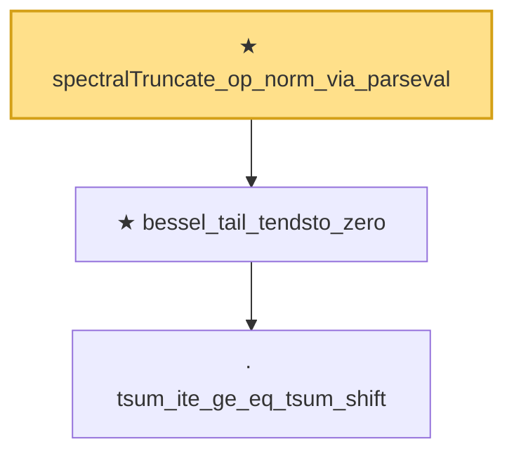

# Proof narrative — spectralTruncate_op_norm_via_parseval

Root: **spectralTruncate_op_norm_via_parseval** (theorem) `Statlib/Mathlib/Analysis/Parseval.lean:166` · topic `Mathlib`
Closure: 3 declarations across 1 files. Generated from `proof_graph.json` — no files were moved.

Reading order (foundations first, headline last):

    · `tsum_ite_ge_eq_tsum_shift` — lemma · `Statlib/Mathlib/Analysis/Parseval.lean:112`
  ★ `bessel_tail_tendsto_zero` — theorem · `Statlib/Mathlib/Analysis/Parseval.lean:139`
★ `spectralTruncate_op_norm_via_parseval` — theorem · `Statlib/Mathlib/Analysis/Parseval.lean:166` **← headline**

## Dependency diagram

