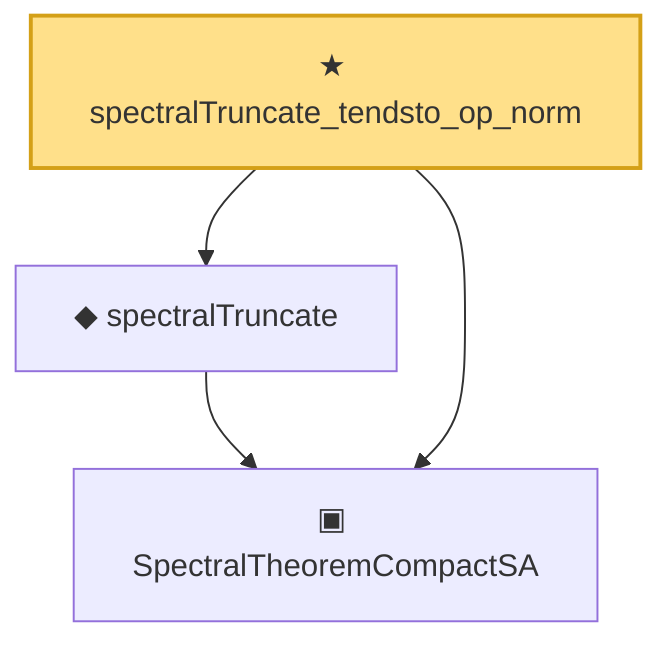

# Proof narrative — spectralTruncate_tendsto_op_norm

Root: **spectralTruncate_tendsto_op_norm** (theorem) `Statlib/Mathlib/Analysis/SpectralTruncation.lean:231` · topic `Mathlib`
Closure: 3 declarations across 2 files. Generated from `proof_graph.json` — no files were moved.

Reading order (foundations first, headline last):

  ▣ `SpectralTheoremCompactSA` — structure · `Statlib/Mathlib/Analysis/SpectralCompactSelfAdjoint.lean:299`  _(also used by 31: SpectralEigenbasisIsTotal, SpectralTheoremCompactSA.toHilbertBasis, inner_eigenfn_spectralTruncate_lt, …)_
  ◆ `spectralTruncate` — noncomputable def · `Statlib/Mathlib/Analysis/SpectralTruncation.lean:98`  _(also used by 17: inner_eigenfn_spectralTruncate_lt, inner_eigenfn_spectralTruncate_ge, inner_eigenfn_residual, …)_
★ `spectralTruncate_tendsto_op_norm` — theorem · `Statlib/Mathlib/Analysis/SpectralTruncation.lean:231` **← headline**

## Dependency diagram

