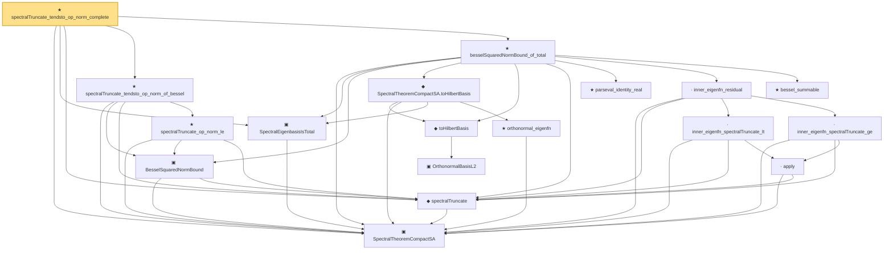

# Proof narrative — spectralTruncate_tendsto_op_norm_complete

Root: **spectralTruncate_tendsto_op_norm_complete** (theorem) `Statlib/Mathlib/Analysis/BesselCompactSA.lean:268` · topic `Mathlib`
Closure: 18 declarations across 6 files. Generated from `proof_graph.json` — no files were moved.

Reading order (foundations first, headline last):

  ▣ `SpectralTheoremCompactSA` — structure · `Statlib/Mathlib/Analysis/SpectralCompactSelfAdjoint.lean:299`  _(also used by 20: eigval_summable_sq_implies_decay, compactSpectralTruncationOfTotal, eigenfn_in_closedSpan, …)_
  ▣ `SpectralEigenbasisIsTotal` — structure · `Statlib/Mathlib/Analysis/BesselCompactSA.lean:63`  _(also used by 2: compactSpectralTruncationOfTotal, eigenbasis_total_of_invariant_subspace_eigenvector)_
  ◆ `spectralTruncate` — noncomputable def · `Statlib/Mathlib/Analysis/SpectralTruncation.lean:98`  _(also used by 9: spectralTruncate_isSelfAdjoint, spectralTruncate_finiteDimensional_range, spectralTruncate_isCompactOperator, …)_
    ▣ `BesselSquaredNormBound` — structure · `Statlib/Mathlib/Analysis/SpectralTruncationConv.lean:162`  _(also used by 1: compactSpectralTruncationOfBessel)_
    ★ `spectralTruncate_op_norm_le` — theorem · `Statlib/Mathlib/Analysis/SpectralTruncationConv.lean:178`
  ★ `spectralTruncate_tendsto_op_norm_of_bessel` — theorem · `Statlib/Mathlib/Analysis/SpectralTruncationConv.lean:215`  _(also used by 1: compactSpectralTruncationOfBessel)_
        ▣ `OrthonormalBasisL2` — structure · `Statlib/Mathlib/MeasureTheory/L2Separable.lean:108`  _(also used by 8: L2Separable.toSeparableSpace, basis_norm_one, basis_orthogonal, …)_
    ◆ `toHilbertBasis` — noncomputable def · `Statlib/Mathlib/MeasureTheory/L2Separable.lean:153`  _(also used by 1: toHilbertSchmidtWitness)_
      ★ `orthonormal_eigenfn` — theorem · `Statlib/Mathlib/Analysis/SpectralCompactSelfAdjoint.lean:323`
    ◆ `SpectralTheoremCompactSA.toHilbertBasis` — noncomputable def · `Statlib/Mathlib/Analysis/BesselCompactSA.lean:77`
    ★ `parseval_identity_real` — theorem · `Statlib/Mathlib/Analysis/Parseval.lean:80`
        · `apply` — lemma · `Statlib/Mathlib/Analysis/SpectralTruncation.lean:107`  _(also used by 12: isCompactOperator_of_op_norm_tendsto, spectralGap_le_dist_of_mem, spectralGap_nonneg, …)_
      · `inner_eigenfn_spectralTruncate_lt` — private lemma · `Statlib/Mathlib/Analysis/BesselCompactSA.lean:93`
      · `inner_eigenfn_spectralTruncate_ge` — private lemma · `Statlib/Mathlib/Analysis/BesselCompactSA.lean:123`
    · `inner_eigenfn_residual` — private lemma · `Statlib/Mathlib/Analysis/BesselCompactSA.lean:142`
    ★ `bessel_summable` — theorem · `Statlib/Mathlib/Analysis/Parseval.lean:94`
  ★ `besselSquaredNormBound_of_total` — theorem · `Statlib/Mathlib/Analysis/BesselCompactSA.lean:177`  _(also used by 1: compactSpectralTruncationOfTotal)_
★ `spectralTruncate_tendsto_op_norm_complete` — theorem · `Statlib/Mathlib/Analysis/BesselCompactSA.lean:268` **← headline**

## Dependency diagram

