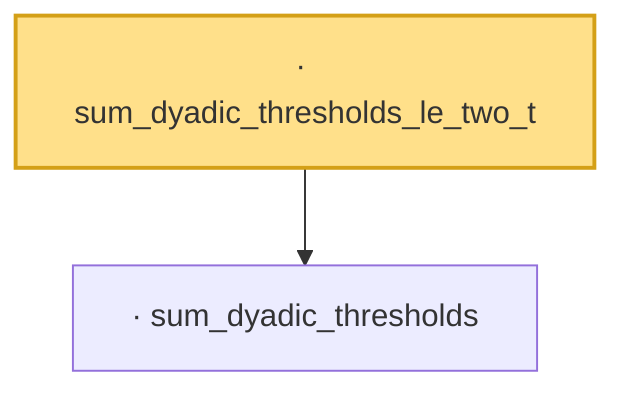

# Proof narrative — sum_dyadic_thresholds_le_two_t

Root: **sum_dyadic_thresholds_le_two_t** (lemma) `Statlib/Mathlib/EmpiricalProcess/VWChainingInduction.lean:313` · topic `Mathlib`
Closure: 2 declarations across 1 files. Generated from `proof_graph.json` — no files were moved.

Reading order (foundations first, headline last):

  · `sum_dyadic_thresholds` — lemma · `Statlib/Mathlib/EmpiricalProcess/VWChainingInduction.lean:291`
· `sum_dyadic_thresholds_le_two_t` — lemma · `Statlib/Mathlib/EmpiricalProcess/VWChainingInduction.lean:313` **← headline**

## Dependency diagram

