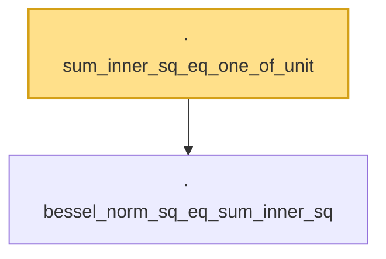

# Proof narrative — sum_inner_sq_eq_one_of_unit

Root: **sum_inner_sq_eq_one_of_unit** (lemma) `Statlib/Mathlib/Analysis/DavisKahanSquaredSin.lean:82` · topic `Mathlib`
Closure: 2 declarations across 1 files. Generated from `proof_graph.json` — no files were moved.

Reading order (foundations first, headline last):

  · `bessel_norm_sq_eq_sum_inner_sq` — lemma · `Statlib/Mathlib/Analysis/DavisKahanSquaredSin.lean:73`  _(also used by 2: norm_apply_sub_eigenvalue_smul_sq, one_sub_inner_sq_le_norm_apply_sub_div_gap_sq)_
· `sum_inner_sq_eq_one_of_unit` — lemma · `Statlib/Mathlib/Analysis/DavisKahanSquaredSin.lean:82` **← headline**

## Dependency diagram

