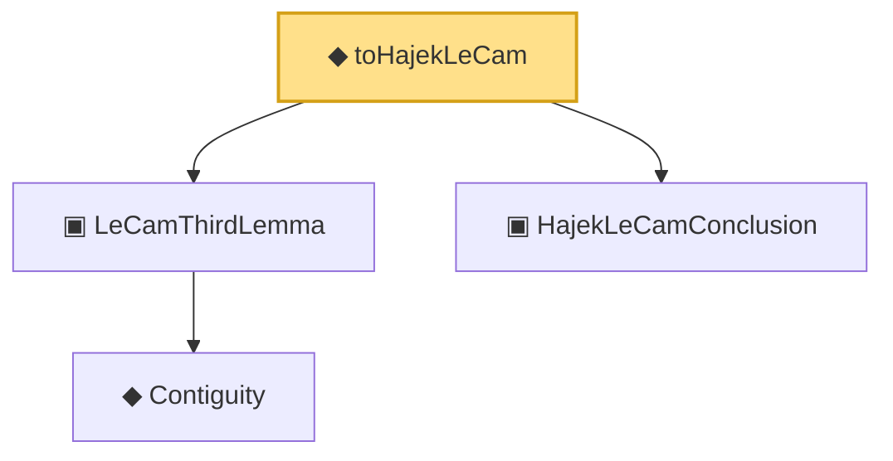

# Proof narrative — toHajekLeCam

Root: **toHajekLeCam** (def) `Statlib/Mathlib/Statistics/LeCamThirdLemma.lean:259` · topic `Mathlib`
Closure: 4 declarations across 2 files. Generated from `proof_graph.json` — no files were moved.

Reading order (foundations first, headline last):

    ◆ `Contiguity` — def · `Statlib/Mathlib/Statistics/LeCamThirdLemma.lean:86`  _(also used by 8: LANToLeCamBundle, fromCoxScoreSample, identityCov, …)_
  ▣ `LeCamThirdLemma` — structure · `Statlib/Mathlib/Statistics/LeCamThirdLemma.lean:160`  _(also used by 5: CoxModel.toCoxTheorem3Hypotheses, cox_theorem_3_end_to_end, toLeCamThirdLemma, …)_
  ▣ `HajekLeCamConclusion` — structure · `Statlib/Mathlib/Statistics/LAN.lean:220`  _(also used by 3: ofLAN, toHajekLeCam, toHajekLeCamViaThird)_
◆ `toHajekLeCam` — def · `Statlib/Mathlib/Statistics/LeCamThirdLemma.lean:259` **← headline**

## Dependency diagram

