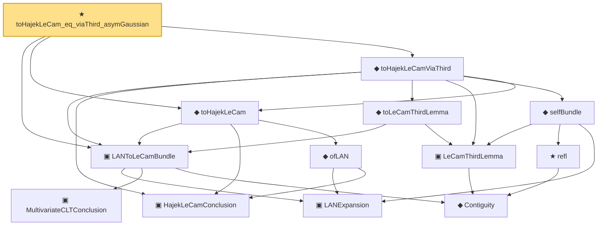

# Proof narrative — toHajekLeCam_eq_viaThird_asymGaussian

Root: **toHajekLeCam_eq_viaThird_asymGaussian** (theorem) `Statlib/Mathlib/Statistics/LeCamInstance.lean:274` · topic `Mathlib`
Closure: 13 declarations across 4 files. Generated from `proof_graph.json` — no files were moved.

Reading order (foundations first, headline last):

    ▣ `LANExpansion` — structure · `Statlib/Mathlib/Statistics/LAN.lean:152`  _(also used by 7: toLANExpansion, CoxModel.toCoxTheorem3Hypotheses, cox_theorem_3_end_to_end, …)_
    ▣ `MultivariateCLTConclusion` — structure · `Statlib/Mathlib/ProbabilityTheory/MultivariateCLT.lean:138`  _(also used by 9: toConclusion, iidBounded, centralLimit_to_multivariateCLTConclusion, …)_
    ◆ `Contiguity` — def · `Statlib/Mathlib/Statistics/LeCamThirdLemma.lean:86`  _(also used by 6: fromCoxScoreSample, identityCov, trans, …)_
  ▣ `LANToLeCamBundle` — structure · `Statlib/Mathlib/Statistics/LeCamInstance.lean:112`  _(also used by 3: toHajekLeCam_eq_viaThird_regular, fromCoxScoreSample, identityCov)_
    ▣ `HajekLeCamConclusion` — structure · `Statlib/Mathlib/Statistics/LAN.lean:220`  _(also used by 1: toHajekLeCam)_
    ◆ `ofLAN` — def · `Statlib/Mathlib/Statistics/LAN.lean:256`
  ◆ `toHajekLeCam` — def · `Statlib/Mathlib/Statistics/LeCamInstance.lean:163`  _(also used by 1: toHajekLeCam_eq_viaThird_regular)_
    ▣ `LeCamThirdLemma` — structure · `Statlib/Mathlib/Statistics/LeCamThirdLemma.lean:160`  _(also used by 4: CoxModel.toCoxTheorem3Hypotheses, cox_theorem_3_end_to_end, toLeCamThirdLemma, …)_
    ◆ `toLeCamThirdLemma` — def · `Statlib/Mathlib/Statistics/LeCamInstance.lean:202`
      ★ `refl` — theorem · `Statlib/Mathlib/Statistics/LeCamThirdLemma.lean:98`  _(also used by 1: refl)_
    ◆ `selfBundle` — def · `Statlib/Mathlib/Statistics/LeCamThirdLemma.lean:184`
  ◆ `toHajekLeCamViaThird` — def · `Statlib/Mathlib/Statistics/LeCamInstance.lean:243`  _(also used by 1: toHajekLeCam_eq_viaThird_regular)_
★ `toHajekLeCam_eq_viaThird_asymGaussian` — theorem · `Statlib/Mathlib/Statistics/LeCamInstance.lean:274` **← headline**

## Dependency diagram

