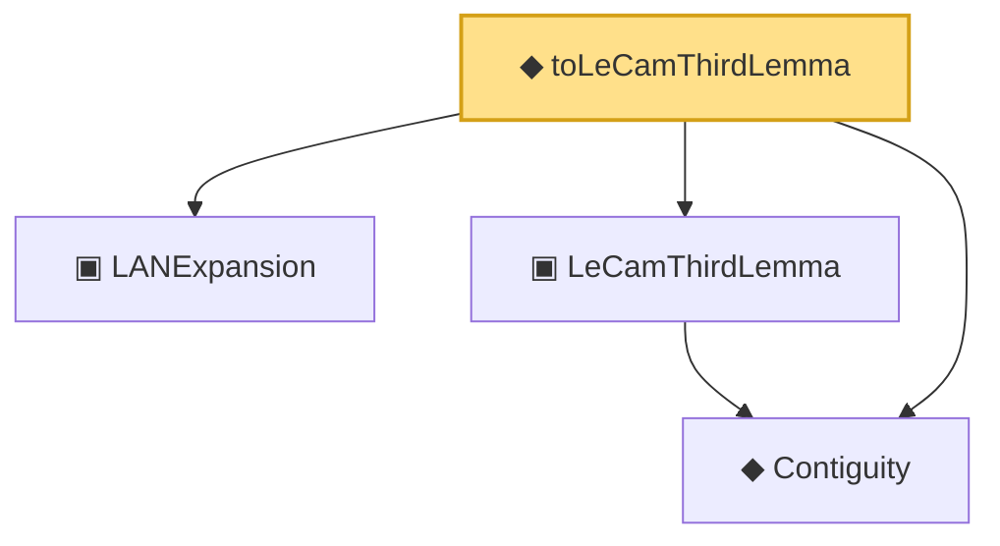

# Proof narrative — toLeCamThirdLemma

Root: **toLeCamThirdLemma** (def) `Statlib/Mathlib/Statistics/LeCamThirdLemma.lean:219` · topic `Mathlib`
Closure: 4 declarations across 2 files. Generated from `proof_graph.json` — no files were moved.

Reading order (foundations first, headline last):

  ▣ `LANExpansion` — structure · `Statlib/Mathlib/Statistics/LAN.lean:152`  _(also used by 9: toLANExpansion, CoxModel.toCoxTheorem3Hypotheses, cox_theorem_3_end_to_end, …)_
  ◆ `Contiguity` — def · `Statlib/Mathlib/Statistics/LeCamThirdLemma.lean:86`  _(also used by 7: LANToLeCamBundle, fromCoxScoreSample, identityCov, …)_
  ▣ `LeCamThirdLemma` — structure · `Statlib/Mathlib/Statistics/LeCamThirdLemma.lean:160`  _(also used by 6: CoxModel.toCoxTheorem3Hypotheses, cox_theorem_3_end_to_end, toLeCamThirdLemma, …)_
◆ `toLeCamThirdLemma` — def · `Statlib/Mathlib/Statistics/LeCamThirdLemma.lean:219` **← headline**

## Dependency diagram

