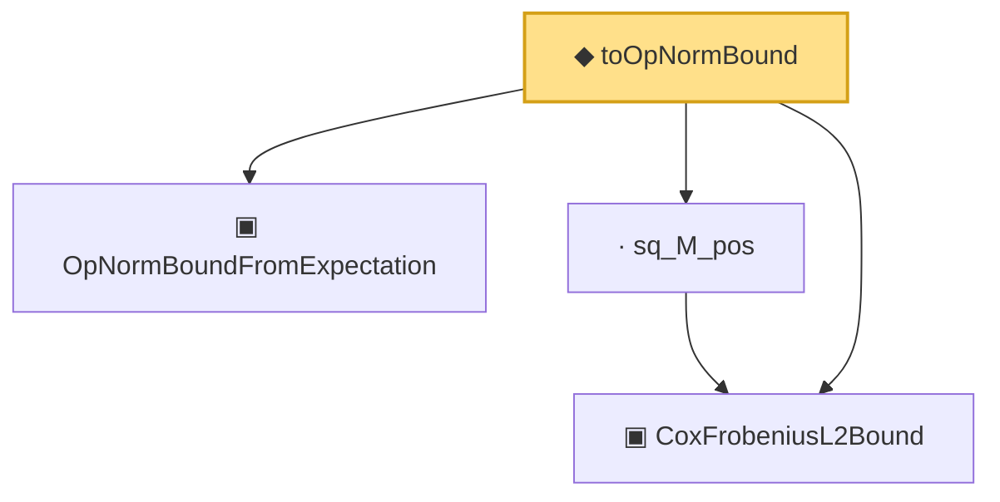

# Proof narrative — toOpNormBound

Root: **toOpNormBound** (noncomputable def) `Statlib/Mathlib/ProbabilityTheory/CoxCovOpNormBound.lean:194` · topic `Mathlib`
Closure: 4 declarations across 2 files. Generated from `proof_graph.json` — no files were moved.

Reading order (foundations first, headline last):

  ▣ `CoxFrobeniusL2Bound` — structure · `Statlib/Mathlib/ProbabilityTheory/CoxCovOpNormBound.lean:141`  _(also used by 2: ofZeroDifference, CoxIIDBundle)_
  ▣ `OpNormBoundFromExpectation` — structure · `Statlib/Mathlib/ProbabilityTheory/RandomMatrixOpNorm.lean:147`  _(also used by 4: OpNormBoundFromExpectation.tendsto_in_prob, OpNormBoundFromExpectation.toCovDiffSq, OpNormBoundFromExpectation.toCovDiffSq_nonneg, …)_
  · `sq_M_pos` — lemma · `Statlib/Mathlib/ProbabilityTheory/CoxCovOpNormBound.lean:171`
◆ `toOpNormBound` — noncomputable def · `Statlib/Mathlib/ProbabilityTheory/CoxCovOpNormBound.lean:194` **← headline**

## Dependency diagram

