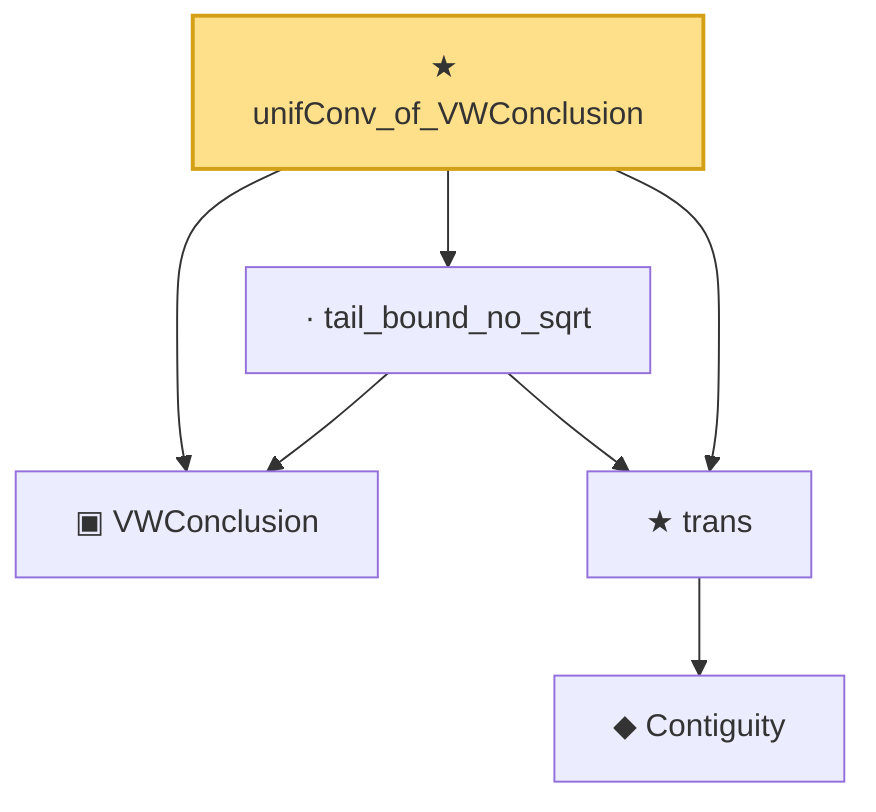

# Proof narrative — unifConv_of_VWConclusion

Root: **unifConv_of_VWConclusion** (theorem) `Statlib/Mathlib/EmpiricalProcess/VWChaining.lean:555` · topic `Mathlib`
Closure: 5 declarations across 2 files. Generated from `proof_graph.json` — no files were moved.

Reading order (foundations first, headline last):

  ▣ `VWConclusion` — structure · `Statlib/Mathlib/EmpiricalProcess/VWChaining.lean:448`  _(also used by 2: vw_2_14_9, VWConclusion.toCoxChangePoint)_
      ◆ `Contiguity` — def · `Statlib/Mathlib/Statistics/LeCamThirdLemma.lean:86`  _(also used by 8: LANToLeCamBundle, fromCoxScoreSample, identityCov, …)_
  ★ `trans` — theorem · `Statlib/Mathlib/Statistics/LeCamThirdLemma.lean:104`  _(also used by 10: davis_kahan_inner_bound, davis_kahan_finite_dim_squared, davisKahanSinTheta_of_finiteDim_aux, …)_
  · `tail_bound_no_sqrt` — lemma · `Statlib/Mathlib/EmpiricalProcess/VWChaining.lean:472`
★ `unifConv_of_VWConclusion` — theorem · `Statlib/Mathlib/EmpiricalProcess/VWChaining.lean:555` **← headline**

## Dependency diagram

