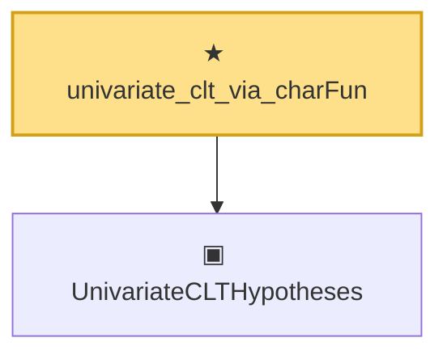

# Proof narrative — univariate_clt_via_charFun

Root: **univariate_clt_via_charFun** (theorem) `Statlib/Mathlib/ProbabilityTheory/UnivariateCLTBridge.lean:125` · topic `Mathlib`
Closure: 2 declarations across 1 files. Generated from `proof_graph.json` — no files were moved.

Reading order (foundations first, headline last):

  ▣ `UnivariateCLTHypotheses` — structure · `Statlib/Mathlib/ProbabilityTheory/UnivariateCLTBridge.lean:96`
★ `univariate_clt_via_charFun` — theorem · `Statlib/Mathlib/ProbabilityTheory/UnivariateCLTBridge.lean:125` **← headline**

## Dependency diagram

