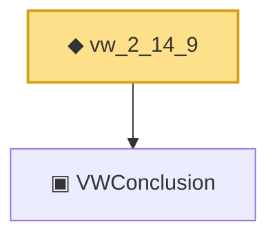

# Proof narrative — vw_2_14_9

Root: **vw_2_14_9** (def) `Statlib/Mathlib/EmpiricalProcess/VWChaining.lean:538` · topic `Mathlib`
Closure: 2 declarations across 1 files. Generated from `proof_graph.json` — no files were moved.

Reading order (foundations first, headline last):

  ▣ `VWConclusion` — structure · `Statlib/Mathlib/EmpiricalProcess/VWChaining.lean:448`  _(also used by 3: tail_bound_no_sqrt, unifConv_of_VWConclusion, VWConclusion.toCoxChangePoint)_
◆ `vw_2_14_9` — def · `Statlib/Mathlib/EmpiricalProcess/VWChaining.lean:538` **← headline**

## Dependency diagram

