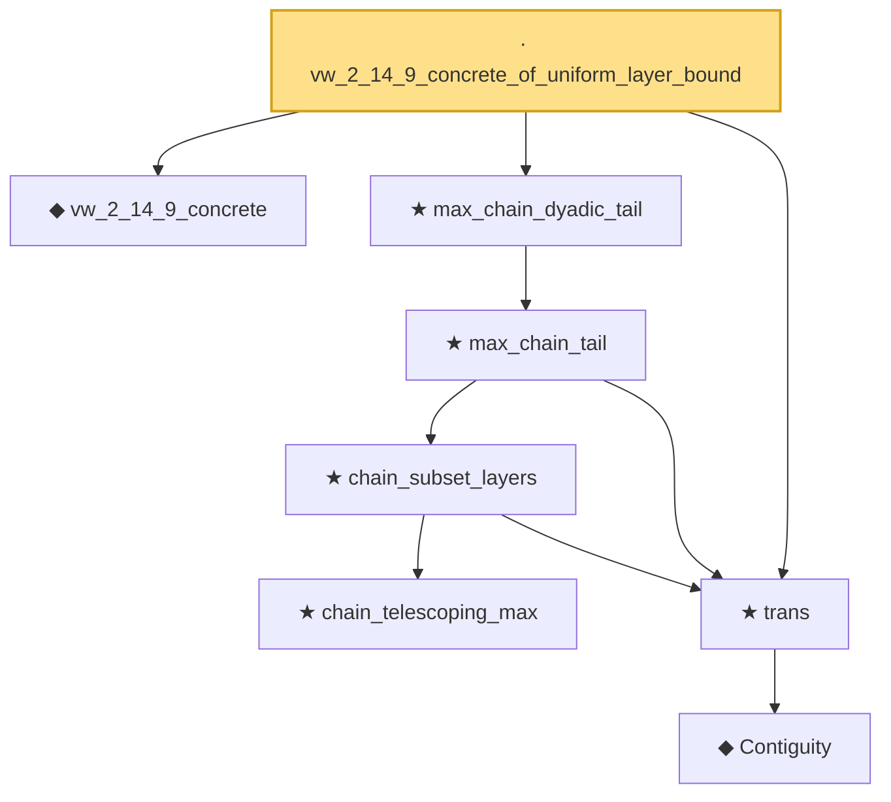

# Proof narrative — vw_2_14_9_concrete_of_uniform_layer_bound

Root: **vw_2_14_9_concrete_of_uniform_layer_bound** (lemma) `Statlib/Mathlib/EmpiricalProcess/VWChainingInduction.lean:364` · topic `Mathlib`
Closure: 8 declarations across 2 files. Generated from `proof_graph.json` — no files were moved.

Reading order (foundations first, headline last):

  ◆ `vw_2_14_9_concrete` — def · `Statlib/Mathlib/EmpiricalProcess/VWChainingInduction.lean:348`
        ★ `chain_telescoping_max` — theorem · `Statlib/Mathlib/EmpiricalProcess/VWChainingInduction.lean:129`
          ◆ `Contiguity` — def · `Statlib/Mathlib/Statistics/LeCamThirdLemma.lean:86`  _(also used by 8: LANToLeCamBundle, fromCoxScoreSample, identityCov, …)_
  ★ `trans` — theorem · `Statlib/Mathlib/Statistics/LeCamThirdLemma.lean:104`  _(also used by 9: davis_kahan_inner_bound, davis_kahan_finite_dim_squared, davisKahanSinTheta_of_finiteDim_aux, …)_
      ★ `chain_subset_layers` — theorem · `Statlib/Mathlib/EmpiricalProcess/VWChainingInduction.lean:165`
    ★ `max_chain_tail` — theorem · `Statlib/Mathlib/EmpiricalProcess/VWChainingInduction.lean:215`
  ★ `max_chain_dyadic_tail` — theorem · `Statlib/Mathlib/EmpiricalProcess/VWChainingInduction.lean:261`
· `vw_2_14_9_concrete_of_uniform_layer_bound` — lemma · `Statlib/Mathlib/EmpiricalProcess/VWChainingInduction.lean:364` **← headline**

## Dependency diagram

