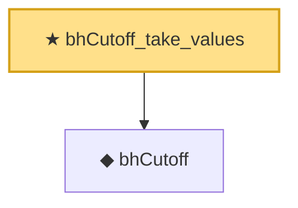

# Proof narrative — bhCutoff_take_values

Root: **bhCutoff_take_values** (theorem) `Statlib/MultipleTesting/bhCutoff_take_values.lean:12` · topic `MultipleTesting`
Closure: 2 declarations across 2 files. Generated from `proof_graph.json` — no files were moved.

Reading order (foundations first, headline last):

  ◆ `bhCutoff` — noncomputable def · `Statlib/MultipleTesting/Basic.lean:111`  _(also used by 5: bhReject, bhCutoff_measurable, bhCutoff_replace_invariant, …)_
★ `bhCutoff_take_values` — theorem · `Statlib/MultipleTesting/bhCutoff_take_values.lean:12` **← headline**

## Dependency diagram

