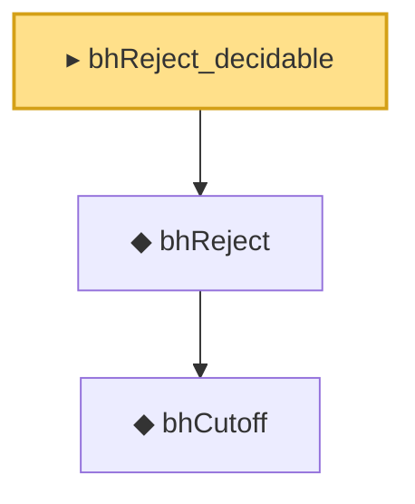

# Proof narrative — bhReject_decidable

Root: **bhReject_decidable** (noncomputable instance) `Statlib/MultipleTesting/Basic.lean:131` · topic `MultipleTesting`
Closure: 3 declarations across 1 files. Generated from `proof_graph.json` — no files were moved.

Reading order (foundations first, headline last):

    ◆ `bhCutoff` — noncomputable def · `Statlib/MultipleTesting/Basic.lean:111`  _(also used by 5: bhCutoff_measurable, bhCutoff_replace_invariant, bhCutoff_take_values, …)_
  ◆ `bhReject` — noncomputable def · `Statlib/MultipleTesting/Basic.lean:125`  _(also used by 5: bhReject_measurableSet, bhRejectionCount, bhRejectionCount_measurable, …)_
▸ `bhReject_decidable` — noncomputable instance · `Statlib/MultipleTesting/Basic.lean:131` **← headline**

## Dependency diagram

