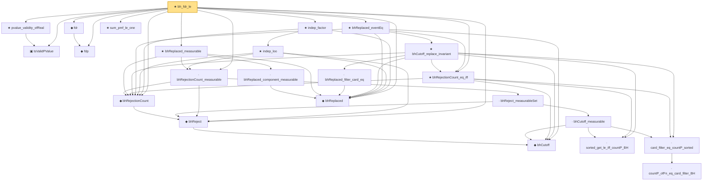

# Proof narrative — bh_fdr_le

Root: **bh_fdr_le** (theorem) `Statlib/MultipleTesting/bh_fdr_le.lean:59` · topic `MultipleTesting`
Closure: 24 declarations across 20 files. Generated from `proof_graph.json` — no files were moved.

Reading order (foundations first, headline last):

  ▣ `IsValidPValue` — structure · `Statlib/MultipleTesting/Basic.lean:51`  _(also used by 1: bonferroni_fwer_le)_
  ◆ `fdp` — noncomputable def · `Statlib/MultipleTesting/Basic.lean:69`
  ◆ `fdr` — noncomputable def · `Statlib/MultipleTesting/Basic.lean:76`
    ◆ `bhCutoff` — noncomputable def · `Statlib/MultipleTesting/Basic.lean:111`  _(also used by 1: bhCutoff_take_values)_
  ◆ `bhReject` — noncomputable def · `Statlib/MultipleTesting/Basic.lean:125`  _(also used by 1: bhReject_decidable)_
  ◆ `bhRejectionCount` — noncomputable def · `Statlib/MultipleTesting/bhRejectionCount.lean:11`
    · `sorted_get_le_iff_countP_BH` — lemma · `Statlib/MultipleTesting/sorted_get_le_iff_countP_BH.lean:14`
          · `countP_ofFn_eq_card_filter_BH` — lemma · `Statlib/MultipleTesting/countP_ofFn_eq_card_filter_BH.lean:16`
    · `card_filter_eq_countP_sorted` — lemma · `Statlib/MultipleTesting/card_filter_eq_countP_sorted.lean:14`
      · `bhCutoff_measurable` — lemma · `Statlib/MultipleTesting/bhCutoff_measurable.lean:21`
    · `bhReject_measurableSet` — lemma · `Statlib/MultipleTesting/bhReject_measurableSet.lean:12`
  · `bhRejectionCount_measurable` — lemma · `Statlib/MultipleTesting/bhRejectionCount_measurable.lean:13`
  ◆ `bhReplaced` — def · `Statlib/MultipleTesting/bhReplaced.lean:11`
    · `bhReplaced_component_measurable` — lemma · `Statlib/MultipleTesting/bhReplaced_component_measurable.lean:14`
  ★ `bhReplaced_measurable` — theorem · `Statlib/MultipleTesting/bhReplaced_measurable.lean:18`
  ★ `bhRejectionCount_eq_iff` — theorem · `Statlib/MultipleTesting/bhRejectionCount_eq_iff.lean:18`
      · `bhReplaced_filter_card_eq` — lemma · `Statlib/MultipleTesting/bhReplaced_filter_card_eq.lean:15`
    ★ `bhCutoff_replace_invariant` — theorem · `Statlib/MultipleTesting/bhCutoff_replace_invariant.lean:29`
  ★ `bhReplaced_eventEq` — theorem · `Statlib/MultipleTesting/bhReplaced_eventEq.lean:27`
    ★ `indep_loo` — theorem · `Statlib/MultipleTesting/indep_loo.lean:22`
  ★ `indep_factor` — theorem · `Statlib/MultipleTesting/indep_factor.lean:14`
  ★ `pvalue_validity_ofReal` — theorem · `Statlib/MultipleTesting/pvalue_validity_ofReal.lean:12`
  ★ `sum_pmf_le_one` — theorem · `Statlib/MultipleTesting/sum_pmf_le_one.lean:11`
★ `bh_fdr_le` — theorem · `Statlib/MultipleTesting/bh_fdr_le.lean:59` **← headline**

## Dependency diagram

