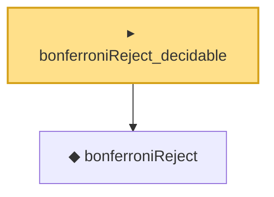

# Proof narrative — bonferroniReject_decidable

Root: **bonferroniReject_decidable** (noncomputable instance) `Statlib/MultipleTesting/Basic.lean:93` · topic `MultipleTesting`
Closure: 2 declarations across 1 files. Generated from `proof_graph.json` — no files were moved.

Reading order (foundations first, headline last):

  ◆ `bonferroniReject` — noncomputable def · `Statlib/MultipleTesting/Basic.lean:88`  _(also used by 1: bonferroni_fwer_le)_
▸ `bonferroniReject_decidable` — noncomputable instance · `Statlib/MultipleTesting/Basic.lean:93` **← headline**

## Dependency diagram

