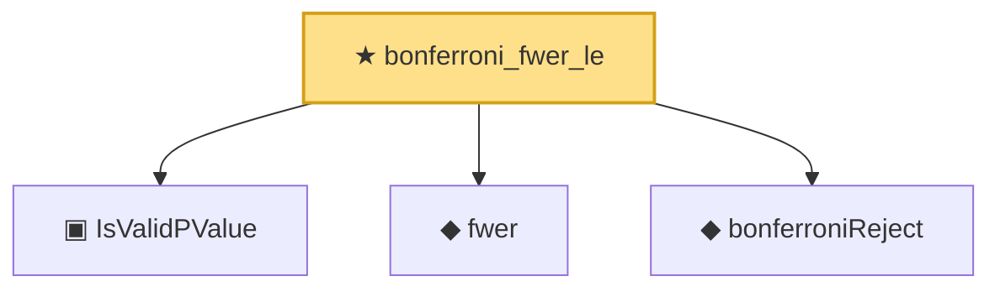

# Proof narrative — bonferroni_fwer_le

Root: **bonferroni_fwer_le** (theorem) `Statlib/MultipleTesting/Bonferroni.lean:49` · topic `MultipleTesting`
Closure: 4 declarations across 2 files. Generated from `proof_graph.json` — no files were moved.

Reading order (foundations first, headline last):

  ▣ `IsValidPValue` — structure · `Statlib/MultipleTesting/Basic.lean:51`  _(also used by 2: bh_fdr_le, pvalue_validity_ofReal)_
  ◆ `fwer` — noncomputable def · `Statlib/MultipleTesting/Basic.lean:61`
  ◆ `bonferroniReject` — noncomputable def · `Statlib/MultipleTesting/Basic.lean:88`  _(also used by 1: bonferroniReject_decidable)_
★ `bonferroni_fwer_le` — theorem · `Statlib/MultipleTesting/Bonferroni.lean:49` **← headline**

## Dependency diagram

