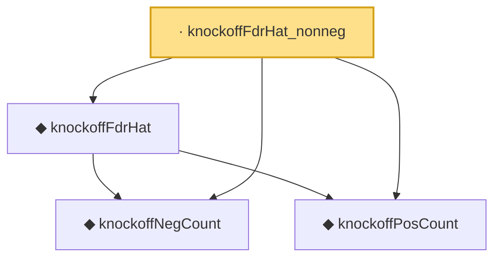

# Proof narrative — knockoffFdrHat_nonneg

Root: **knockoffFdrHat_nonneg** (lemma) `Statlib/MultipleTesting/knockoffFdrHat_nonneg.lean:11` · topic `MultipleTesting`
Closure: 4 declarations across 4 files. Generated from `proof_graph.json` — no files were moved.

Reading order (foundations first, headline last):

  ◆ `knockoffNegCount` — noncomputable def · `Statlib/MultipleTesting/knockoffNegCount.lean:8`
  ◆ `knockoffPosCount` — noncomputable def · `Statlib/MultipleTesting/knockoffPosCount.lean:8`
  ◆ `knockoffFdrHat` — noncomputable def · `Statlib/MultipleTesting/knockoffFdrHat.lean:11`
· `knockoffFdrHat_nonneg` — lemma · `Statlib/MultipleTesting/knockoffFdrHat_nonneg.lean:11` **← headline**

## Dependency diagram

