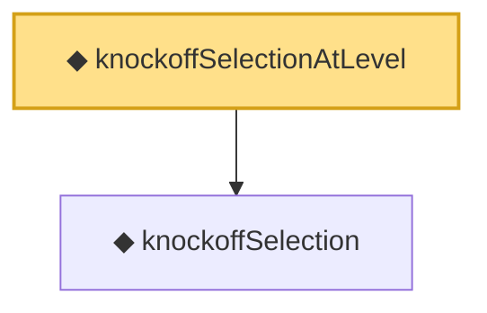

# Proof narrative — knockoffSelectionAtLevel

Root: **knockoffSelectionAtLevel** (noncomputable def) `Statlib/MultipleTesting/knockoffSelectionAtLevel.lean:13` · topic `MultipleTesting`
Closure: 2 declarations across 2 files. Generated from `proof_graph.json` — no files were moved.

Reading order (foundations first, headline last):

  ◆ `knockoffSelection` — noncomputable def · `Statlib/MultipleTesting/knockoffSelection.lean:8`  _(also used by 2: knockoffSelection_antitone, knockoffSelection_subset_pos)_
◆ `knockoffSelectionAtLevel` — noncomputable def · `Statlib/MultipleTesting/knockoffSelectionAtLevel.lean:13` **← headline**

## Dependency diagram

