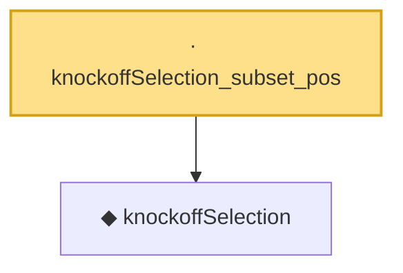

# Proof narrative — knockoffSelection_subset_pos

Root: **knockoffSelection_subset_pos** (lemma) `Statlib/MultipleTesting/knockoffSelection_subset_pos.lean:10` · topic `MultipleTesting`
Closure: 2 declarations across 2 files. Generated from `proof_graph.json` — no files were moved.

Reading order (foundations first, headline last):

  ◆ `knockoffSelection` — noncomputable def · `Statlib/MultipleTesting/knockoffSelection.lean:8`  _(also used by 2: knockoffSelectionAtLevel, knockoffSelection_antitone)_
· `knockoffSelection_subset_pos` — lemma · `Statlib/MultipleTesting/knockoffSelection_subset_pos.lean:10` **← headline**

## Dependency diagram

