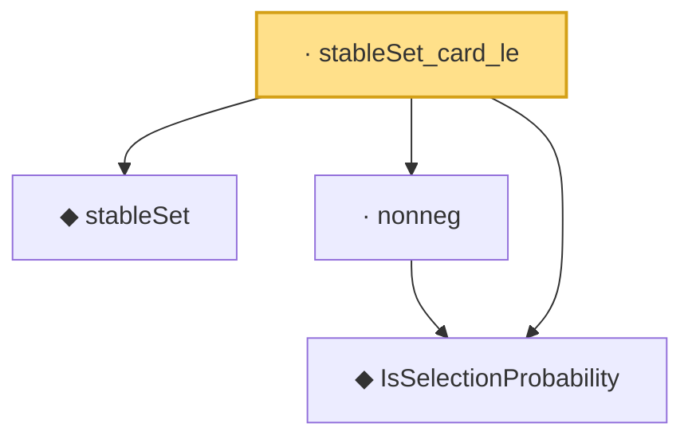

# Proof narrative — stableSet_card_le

Root: **stableSet_card_le** (lemma) `Statlib/MultipleTesting/stableSet_card_le.lean:12` · topic `MultipleTesting`
Closure: 4 declarations across 4 files. Generated from `proof_graph.json` — no files were moved.

Reading order (foundations first, headline last):

  ◆ `IsSelectionProbability` — def · `Statlib/MultipleTesting/IsSelectionProbability.lean:10`  _(also used by 2: le_one, stableSet_empty_of_threshold_gt_one)_
  ◆ `stableSet` — noncomputable def · `Statlib/MultipleTesting/stableSet.lean:8`  _(also used by 2: stableSet_empty_of_threshold_gt_one, stableSet_mono)_
  · `nonneg` — lemma · `Statlib/MultipleTesting/nonneg.lean:9`
· `stableSet_card_le` — lemma · `Statlib/MultipleTesting/stableSet_card_le.lean:12` **← headline**

## Dependency diagram

