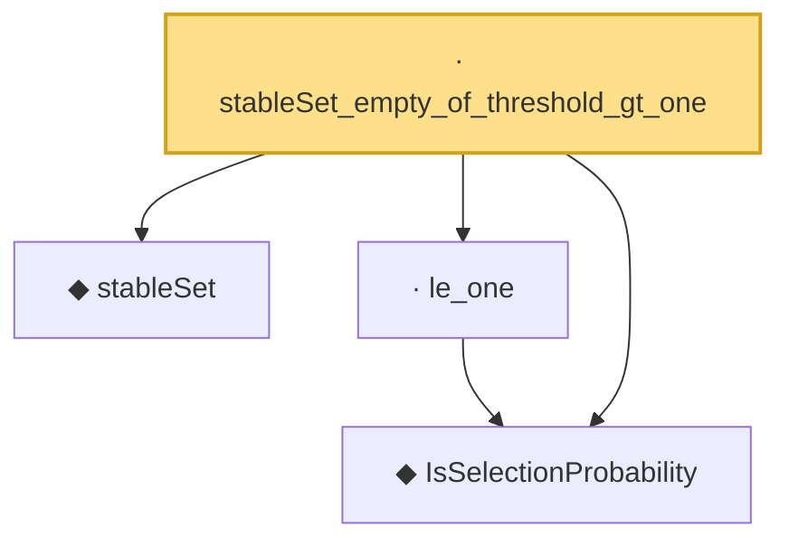

# Proof narrative — stableSet_empty_of_threshold_gt_one

Root: **stableSet_empty_of_threshold_gt_one** (lemma) `Statlib/MultipleTesting/stableSet_empty_of_threshold_gt_one.lean:11` · topic `MultipleTesting`
Closure: 4 declarations across 4 files. Generated from `proof_graph.json` — no files were moved.

Reading order (foundations first, headline last):

  ◆ `IsSelectionProbability` — def · `Statlib/MultipleTesting/IsSelectionProbability.lean:10`  _(also used by 2: nonneg, stableSet_card_le)_
  ◆ `stableSet` — noncomputable def · `Statlib/MultipleTesting/stableSet.lean:8`  _(also used by 2: stableSet_card_le, stableSet_mono)_
  · `le_one` — lemma · `Statlib/MultipleTesting/le_one.lean:9`
· `stableSet_empty_of_threshold_gt_one` — lemma · `Statlib/MultipleTesting/stableSet_empty_of_threshold_gt_one.lean:11` **← headline**

## Dependency diagram

