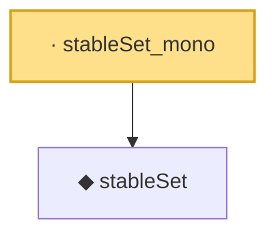

# Proof narrative — stableSet_mono

Root: **stableSet_mono** (lemma) `Statlib/MultipleTesting/stableSet_mono.lean:9` · topic `MultipleTesting`
Closure: 2 declarations across 2 files. Generated from `proof_graph.json` — no files were moved.

Reading order (foundations first, headline last):

  ◆ `stableSet` — noncomputable def · `Statlib/MultipleTesting/stableSet.lean:8`  _(also used by 2: stableSet_card_le, stableSet_empty_of_threshold_gt_one)_
· `stableSet_mono` — lemma · `Statlib/MultipleTesting/stableSet_mono.lean:9` **← headline**

## Dependency diagram

