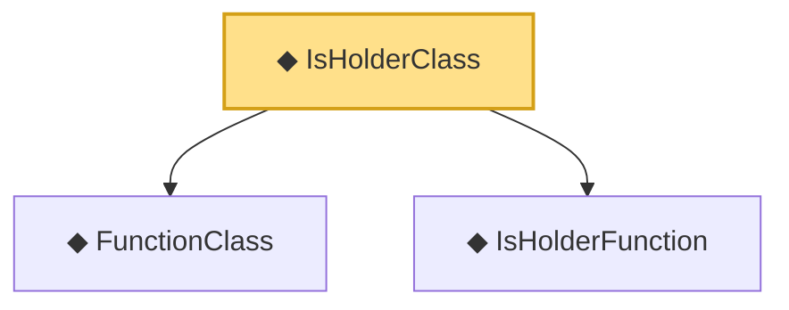

# Proof narrative — IsHolderClass

Root: **IsHolderClass** (def) `Statlib/Nonparametric/Vocabulary/FunctionClasses.lean:48` · topic `Nonparametric`
Closure: 3 declarations across 1 files. Generated from `proof_graph.json` — no files were moved.

Reading order (foundations first, headline last):

  ◆ `FunctionClass` — abbrev · `Statlib/Nonparametric/Vocabulary/FunctionClasses.lean:16`  _(also used by 21: holder_classApproximationError_le_of_net_member, kernel_smoother_classApproximationError_le_of_holder_bias_member, kernel_smoother_classApproximationError_le_of_holder_bias_rate, …)_
  ◆ `IsHolderFunction` — def · `Statlib/Nonparametric/Vocabulary/FunctionClasses.lean:44`  _(also used by 18: holder_net_approx_sup_bound, holder_net_integratedSquaredError_bound, holder_classApproximationError_le_of_net_member, …)_
◆ `IsHolderClass` — def · `Statlib/Nonparametric/Vocabulary/FunctionClasses.lean:48` **← headline**

## Dependency diagram

