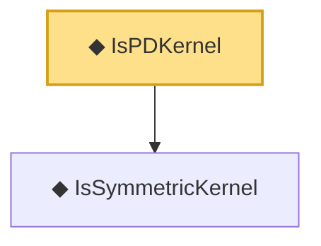

# Proof narrative — IsPDKernel

Root: **IsPDKernel** (def) `Statlib/Nonparametric/Vocabulary/KernelMethods.lean:35` · topic `Nonparametric`
Closure: 2 declarations across 1 files. Generated from `proof_graph.json` — no files were moved.

Reading order (foundations first, headline last):

  ◆ `IsSymmetricKernel` — def · `Statlib/Nonparametric/Vocabulary/KernelMethods.lean:17`  _(also used by 3: IsPSDKernel, rkhsModel_kernel_symm, rkhsModel_kernel_psd)_
◆ `IsPDKernel` — def · `Statlib/Nonparametric/Vocabulary/KernelMethods.lean:35` **← headline**

## Dependency diagram

