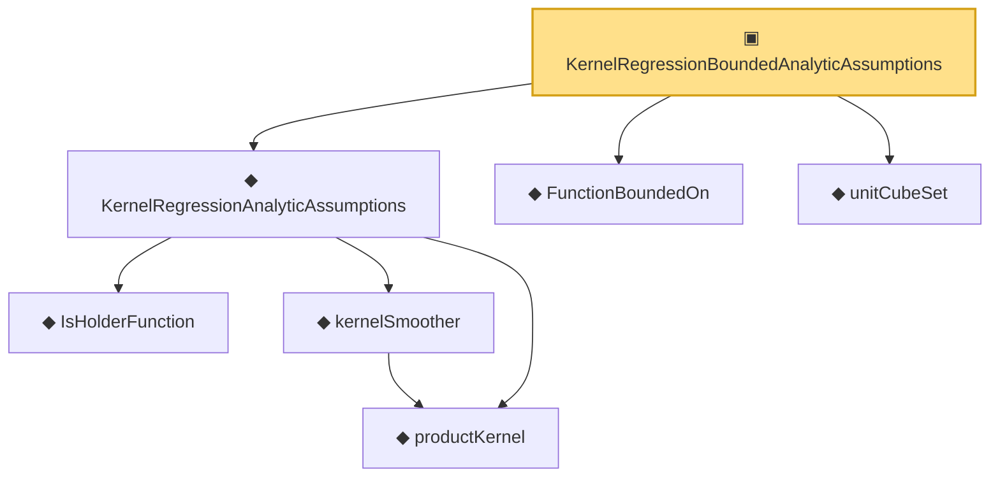

# Proof narrative — KernelRegressionBoundedAnalyticAssumptions

Root: **KernelRegressionBoundedAnalyticAssumptions** (structure) `Statlib/Nonparametric/Vocabulary/KernelRegression.lean:108` · topic `Nonparametric`
Closure: 7 declarations across 3 files. Generated from `proof_graph.json` — no files were moved.

Reading order (foundations first, headline last):

    ◆ `productKernel` — noncomputable def · `Statlib/Nonparametric/Vocabulary/Kernel.lean:28`  _(also used by 8: kernel_holder_bias_normalized, kernel_holder_bias_integratedSquaredError_bound, kernel_smoother_classApproximationError_le_of_holder_bias_member, …)_
    ◆ `IsHolderFunction` — def · `Statlib/Nonparametric/Vocabulary/FunctionClasses.lean:44`  _(also used by 18: holder_net_approx_sup_bound, holder_net_integratedSquaredError_bound, holder_classApproximationError_le_of_net_member, …)_
    ◆ `kernelSmoother` — noncomputable def · `Statlib/Nonparametric/Vocabulary/Kernel.lean:39`  _(also used by 17: kernel_holder_bias_integratedSquaredError_bound, kernel_smoother_classApproximationError_le_of_holder_bias_member, kernel_smoother_classApproximationError_le_of_holder_bias_rate, …)_
  ◆ `KernelRegressionAnalyticAssumptions` — def · `Statlib/Nonparametric/Vocabulary/KernelRegression.lean:88`
  ◆ `FunctionBoundedOn` — def · `Statlib/Nonparametric/Vocabulary/KernelRegression.lean:35`  _(also used by 1: kernel_centered_mse_bound_of_uniform_design_interior_bounded)_
  ◆ `unitCubeSet` — def · `Statlib/Nonparametric/Vocabulary/KernelRegression.lean:21`  _(also used by 1: kernel_centered_mse_bound_of_uniform_design_interior_bounded)_
▣ `KernelRegressionBoundedAnalyticAssumptions` — structure · `Statlib/Nonparametric/Vocabulary/KernelRegression.lean:108` **← headline**

## Dependency diagram

