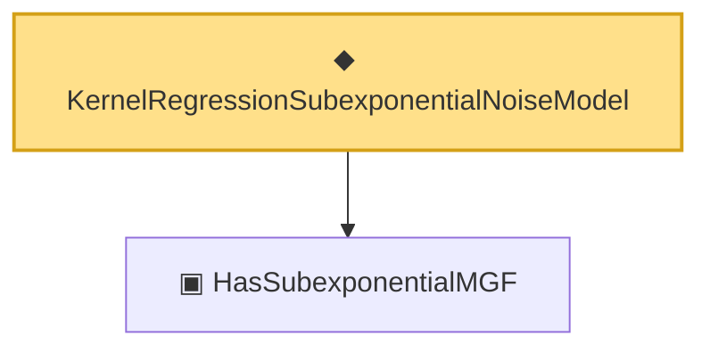

# Proof narrative — KernelRegressionSubexponentialNoiseModel

Root: **KernelRegressionSubexponentialNoiseModel** (def) `Statlib/Nonparametric/Vocabulary/KernelRegression.lean:119` · topic `Nonparametric`
Closure: 2 declarations across 2 files. Generated from `proof_graph.json` — no files were moved.

Reading order (foundations first, headline last):

  ▣ `HasSubexponentialMGF` — structure · `Statlib/StatFoundation/Vocabulary/RandomVariable.lean:74`  _(also used by 32: coord_mul_subexponential_exists_of_indep, subexponential_mgf_const_mul_relaxed, coord_mul_scaled_subexponential_exists_of_indep, …)_
◆ `KernelRegressionSubexponentialNoiseModel` — def · `Statlib/Nonparametric/Vocabulary/KernelRegression.lean:119` **← headline**

## Dependency diagram

