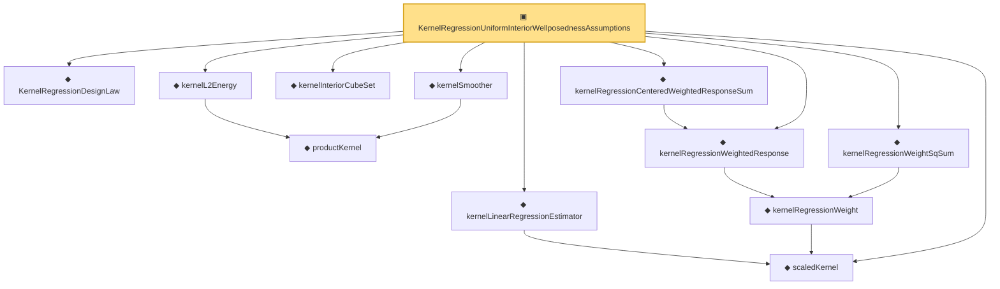

# Proof narrative — KernelRegressionUniformInteriorWellposednessAssumptions

Root: **KernelRegressionUniformInteriorWellposednessAssumptions** (structure) `Statlib/Nonparametric/Vocabulary/KernelRegression.lean:247` · topic `Nonparametric`
Closure: 12 declarations across 2 files. Generated from `proof_graph.json` — no files were moved.

Reading order (foundations first, headline last):

  ◆ `KernelRegressionDesignLaw` — def · `Statlib/Nonparametric/Vocabulary/KernelRegression.lean:41`  _(also used by 2: kernel_uniform_interior_l2_energy_bound, kernel_uniform_interior_population_smoother_eq)_
  ◆ `scaledKernel` — noncomputable def · `Statlib/Nonparametric/Vocabulary/Kernel.lean:33`  _(also used by 14: kernel_scaled_l2_denominator_bridge, kernel_scaled_l2_denominator_bridge_from_weight_energy_bound, kernel_uniform_interior_l2_energy_bound, …)_
    ◆ `productKernel` — noncomputable def · `Statlib/Nonparametric/Vocabulary/Kernel.lean:28`  _(also used by 8: kernel_holder_bias_normalized, kernel_holder_bias_integratedSquaredError_bound, kernel_smoother_classApproximationError_le_of_holder_bias_member, …)_
  ◆ `kernelL2Energy` — noncomputable def · `Statlib/Nonparametric/Vocabulary/Kernel.lean:51`  _(also used by 7: kernel_scaled_l2_denominator_bridge, kernel_scaled_l2_denominator_bridge_from_weight_energy_bound, kernel_uniform_interior_l2_energy_bound, …)_
  ◆ `kernelInteriorCubeSet` — def · `Statlib/Nonparametric/Vocabulary/KernelRegression.lean:26`  _(also used by 1: kernel_uniform_interior_population_smoother_eq)_
  ◆ `kernelSmoother` — noncomputable def · `Statlib/Nonparametric/Vocabulary/Kernel.lean:39`  _(also used by 17: kernel_holder_bias_integratedSquaredError_bound, kernel_smoother_classApproximationError_le_of_holder_bias_member, kernel_smoother_classApproximationError_le_of_holder_bias_rate, …)_
  ◆ `kernelLinearRegressionEstimator` — noncomputable def · `Statlib/Nonparametric/Vocabulary/Kernel.lean:56`  _(also used by 10: kernel_regression_centered_integrability_of_centered_sum_integrability, kernel_regression_risk_integrability_of_error_integrability_and_design_l2, kernel_regression_mse_x_integrable_of_centered_x_and_bias, …)_
    ◆ `kernelRegressionWeight` — noncomputable def · `Statlib/Nonparametric/Vocabulary/KernelRegression.lean:51`
  ◆ `kernelRegressionWeightedResponse` — noncomputable def · `Statlib/Nonparametric/Vocabulary/KernelRegression.lean:58`  _(also used by 2: kernel_centered_sum_omega_integrable_of_summand_square_integrable, kernel_centered_sum_integrability_of_summand_l2_and_variance_bound)_
  ◆ `kernelRegressionCenteredWeightedResponseSum` — noncomputable def · `Statlib/Nonparametric/Vocabulary/KernelRegression.lean:73`  _(also used by 6: kernel_centered_sum_omega_integrable_of_summand_square_integrable, kernel_centered_sum_x_integrable_of_variance_bound_and_design_l2, kernel_centered_sum_integrability_of_summand_l2_and_variance_bound, …)_
  ◆ `kernelRegressionWeightSqSum` — noncomputable def · `Statlib/Nonparametric/Vocabulary/KernelRegression.lean:65`  _(also used by 3: kernel_centered_sum_x_integrable_of_variance_bound_and_design_l2, kernel_centered_sum_integrability_of_summand_l2_and_variance_bound, kernel_centered_mse_bound_of_uniform_design_interior_bounded)_
▣ `KernelRegressionUniformInteriorWellposednessAssumptions` — structure · `Statlib/Nonparametric/Vocabulary/KernelRegression.lean:247` **← headline**

## Dependency diagram

