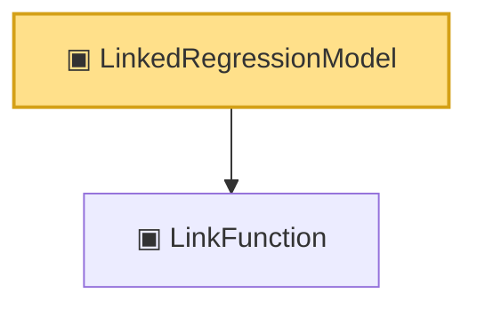

# Proof narrative — LinkedRegressionModel

Root: **LinkedRegressionModel** (structure) `Statlib/Nonparametric/Vocabulary/Models.lean:45` · topic `Nonparametric`
Closure: 2 declarations across 1 files. Generated from `proof_graph.json` — no files were moved.

Reading order (foundations first, headline last):

  ▣ `LinkFunction` — structure · `Statlib/Nonparametric/Vocabulary/Models.lean:27`  _(also used by 3: logisticLinkFunction, linkedMean, linkedPredictionRisk)_
▣ `LinkedRegressionModel` — structure · `Statlib/Nonparametric/Vocabulary/Models.lean:45` **← headline**

## Dependency diagram

