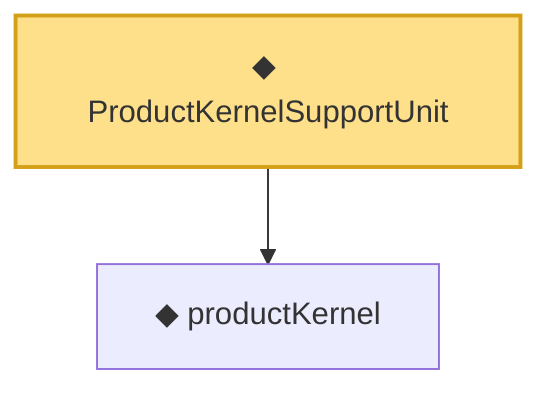

# Proof narrative — ProductKernelSupportUnit

Root: **ProductKernelSupportUnit** (def) `Statlib/Nonparametric/Vocabulary/KernelRegression.lean:31` · topic `Nonparametric`
Closure: 2 declarations across 2 files. Generated from `proof_graph.json` — no files were moved.

Reading order (foundations first, headline last):

  ◆ `productKernel` — noncomputable def · `Statlib/Nonparametric/Vocabulary/Kernel.lean:28`  _(also used by 9: kernel_holder_bias_normalized, kernel_holder_bias_integratedSquaredError_bound, kernel_smoother_classApproximationError_le_of_holder_bias_member, …)_
◆ `ProductKernelSupportUnit` — def · `Statlib/Nonparametric/Vocabulary/KernelRegression.lean:31` **← headline**

## Dependency diagram

