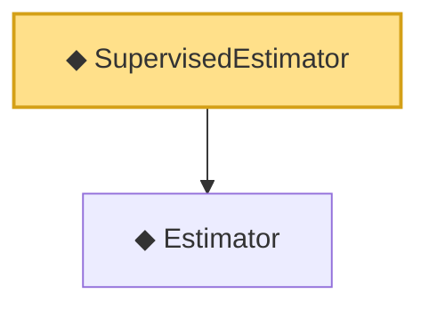

# Proof narrative — SupervisedEstimator

Root: **SupervisedEstimator** (abbrev) `Statlib/Nonparametric/Vocabulary/Estimator.lean:24` · topic `Nonparametric`
Closure: 2 declarations across 1 files. Generated from `proof_graph.json` — no files were moved.

Reading order (foundations first, headline last):

  ◆ `Estimator` — abbrev · `Statlib/Nonparametric/Vocabulary/Estimator.lean:16`  _(also used by 1: UnsupervisedEstimator)_
◆ `SupervisedEstimator` — abbrev · `Statlib/Nonparametric/Vocabulary/Estimator.lean:24` **← headline**

## Dependency diagram

