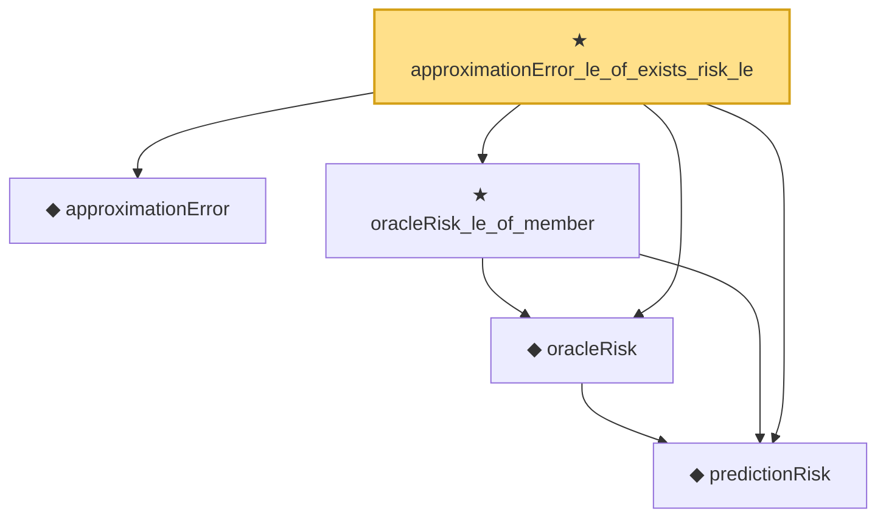

# Proof narrative — approximationError_le_of_exists_risk_le

Root: **approximationError_le_of_exists_risk_le** (theorem) `Statlib/Nonparametric/OracleInterface/Risk.lean:21` · topic `Nonparametric`
Closure: 5 declarations across 2 files. Generated from `proof_graph.json` — no files were moved.

Reading order (foundations first, headline last):

  ◆ `predictionRisk` — noncomputable def · `Statlib/Nonparametric/Vocabulary/Risk.lean:24`  _(also used by 3: linkedPredictionRisk, logisticRisk, squaredPredictionRisk)_
  ◆ `approximationError` — def · `Statlib/Nonparametric/Vocabulary/Risk.lean:52`
  ◆ `oracleRisk` — noncomputable def · `Statlib/Nonparametric/Vocabulary/Risk.lean:47`
  ★ `oracleRisk_le_of_member` — theorem · `Statlib/Nonparametric/OracleInterface/Risk.lean:9`
★ `approximationError_le_of_exists_risk_le` — theorem · `Statlib/Nonparametric/OracleInterface/Risk.lean:21` **← headline**

## Dependency diagram

