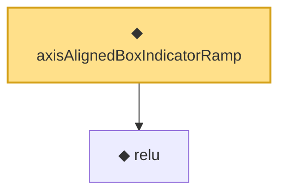

# Proof narrative — axisAlignedBoxIndicatorRamp

Root: **axisAlignedBoxIndicatorRamp** (noncomputable def) `Statlib/Nonparametric/Vocabulary/NeuralNetwork.lean:254` · topic `Nonparametric`
Closure: 2 declarations across 1 files. Generated from `proof_graph.json` — no files were moved.

Reading order (foundations first, headline last):

  ◆ `relu` — def · `Statlib/Nonparametric/Vocabulary/NeuralNetwork.lean:15`  _(also used by 44: squareReLUHingeInterpolant_error_le_of_mem_cell, unitIntervalSquareReLUHingeNet_realize, exists_fullyConnectedReLUNet_interval_square_approx, …)_
◆ `axisAlignedBoxIndicatorRamp` — noncomputable def · `Statlib/Nonparametric/Vocabulary/NeuralNetwork.lean:254` **← headline**

## Dependency diagram

