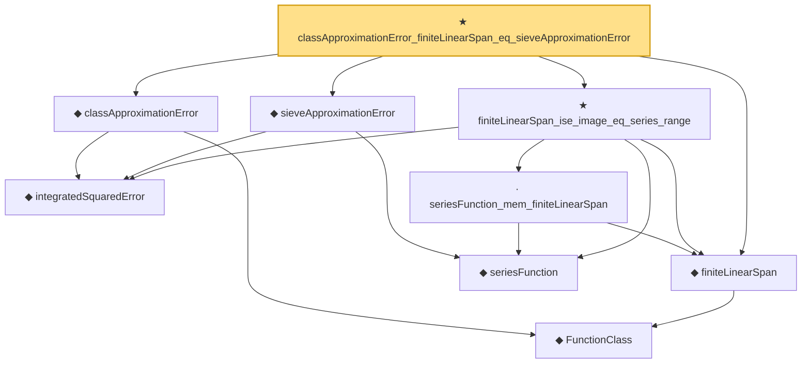

# Proof narrative — classApproximationError_finiteLinearSpan_eq_sieveApproximationError

Root: **classApproximationError_finiteLinearSpan_eq_sieveApproximationError** (theorem) `Statlib/Nonparametric/Approximation/Sieve.lean:240` · topic `Nonparametric`
Closure: 9 declarations across 4 files. Generated from `proof_graph.json` — no files were moved.

Reading order (foundations first, headline last):

    ◆ `FunctionClass` — abbrev · `Statlib/Nonparametric/Vocabulary/FunctionClasses.lean:16`  _(also used by 20: holder_classApproximationError_le_of_net_member, kernel_smoother_classApproximationError_le_of_holder_bias_member, kernel_smoother_classApproximationError_le_of_holder_bias_rate, …)_
    ◆ `integratedSquaredError` — noncomputable def · `Statlib/Nonparametric/Vocabulary/Risk.lean:60`  _(also used by 32: supNormBall_classApproximationError_self_le_zero, holder_net_integratedSquaredError_bound, holder_classApproximationError_le_of_net_member, …)_
  ◆ `classApproximationError` — noncomputable def · `Statlib/Nonparametric/Vocabulary/Risk.lean:75`  _(also used by 21: supNormBall_classApproximationError_self_le_zero, holder_classApproximationError_le_of_net_member, holderBall_classApproximationError_self_le_zero, …)_
  ◆ `finiteLinearSpan` — noncomputable def · `Statlib/Nonparametric/Vocabulary/Sieve.lean:23`  _(also used by 8: finiteLinearSpan_classApproximationError_le_of_holder_selector_net, holder_selector_net_classApproximationError_le_rate, finiteLinearSpan_classApproximationError_le_of_coefficients, …)_
    ◆ `seriesFunction` — noncomputable def · `Statlib/Nonparametric/Vocabulary/Sieve.lean:27`  _(also used by 37: holder_selectorIndicator_series_pointwise_bound, holder_selectorIndicator_series_integratedSquaredError_bound, finiteLinearSpan_classApproximationError_le_of_holder_selector_net, …)_
  ◆ `sieveApproximationError` — noncomputable def · `Statlib/Nonparametric/Vocabulary/Sieve.lean:42`  _(also used by 26: sieveApproximationError_le_of_holder_selector_net, holderBall_selectorIndicator_sieveApproximationError_uniform_bound, exists_selectorIndicatorSieve_for_holderBall_of_finite_net, …)_
    · `seriesFunction_mem_finiteLinearSpan` — lemma · `Statlib/Nonparametric/Approximation/Sieve.lean:13`  _(also used by 5: finiteLinearSpan_classApproximationError_le_of_holder_selector_net, finiteLinearSpan_classApproximationError_le_of_coefficients, finiteLinearSpan_classApproximationError_le_of_pointwise_series_bound, …)_
  ★ `finiteLinearSpan_ise_image_eq_series_range` — theorem · `Statlib/Nonparametric/Approximation/Sieve.lean:218`
★ `classApproximationError_finiteLinearSpan_eq_sieveApproximationError` — theorem · `Statlib/Nonparametric/Approximation/Sieve.lean:240` **← headline**

## Dependency diagram

