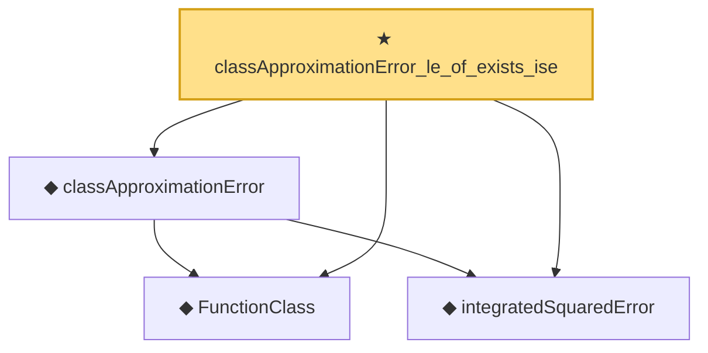

# Proof narrative — classApproximationError_le_of_exists_ise

Root: **classApproximationError_le_of_exists_ise** (theorem) `Statlib/Nonparametric/Approximation/Metric.lean:120` · topic `Nonparametric`
Closure: 4 declarations across 3 files. Generated from `proof_graph.json` — no files were moved.

Reading order (foundations first, headline last):

  ◆ `FunctionClass` — abbrev · `Statlib/Nonparametric/Vocabulary/FunctionClasses.lean:16`  _(also used by 20: holder_classApproximationError_le_of_net_member, kernel_smoother_classApproximationError_le_of_holder_bias_member, kernel_smoother_classApproximationError_le_of_holder_bias_rate, …)_
  ◆ `integratedSquaredError` — noncomputable def · `Statlib/Nonparametric/Vocabulary/Risk.lean:60`  _(also used by 33: supNormBall_classApproximationError_self_le_zero, holder_net_integratedSquaredError_bound, holder_classApproximationError_le_of_net_member, …)_
  ◆ `classApproximationError` — noncomputable def · `Statlib/Nonparametric/Vocabulary/Risk.lean:75`  _(also used by 21: supNormBall_classApproximationError_self_le_zero, holder_classApproximationError_le_of_net_member, holderBall_classApproximationError_self_le_zero, …)_
★ `classApproximationError_le_of_exists_ise` — theorem · `Statlib/Nonparametric/Approximation/Metric.lean:120` **← headline**

## Dependency diagram

