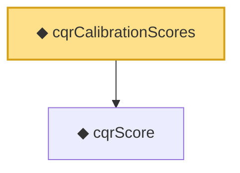

# Proof narrative — cqrCalibrationScores

Root: **cqrCalibrationScores** (def) `Statlib/Nonparametric/Vocabulary/ConformalQuantileRegression.lean:22` · topic `Nonparametric`
Closure: 2 declarations across 1 files. Generated from `proof_graph.json` — no files were moved.

Reading order (foundations first, headline last):

  ◆ `cqrScore` — def · `Statlib/Nonparametric/Vocabulary/ConformalQuantileRegression.lean:14`  _(also used by 3: mem_cqrInterval_iff_score_le, cqr_miscoverage_event_eq_score_event, cqrTestScore)_
◆ `cqrCalibrationScores` — def · `Statlib/Nonparametric/Vocabulary/ConformalQuantileRegression.lean:22` **← headline**

## Dependency diagram

