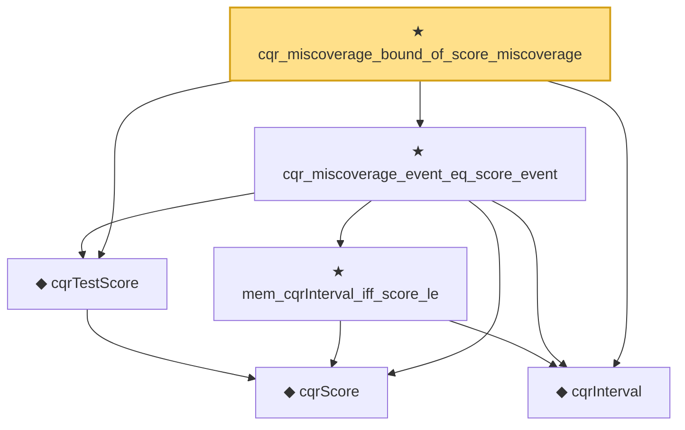

# Proof narrative — cqr_miscoverage_bound_of_score_miscoverage

Root: **cqr_miscoverage_bound_of_score_miscoverage** (theorem) `Statlib/Nonparametric/ConformalQuantileRegression.lean:52` · topic `Nonparametric`
Closure: 6 declarations across 2 files. Generated from `proof_graph.json` — no files were moved.

Reading order (foundations first, headline last):

    ◆ `cqrScore` — def · `Statlib/Nonparametric/Vocabulary/ConformalQuantileRegression.lean:14`  _(also used by 1: cqrCalibrationScores)_
  ◆ `cqrTestScore` — def · `Statlib/Nonparametric/Vocabulary/ConformalQuantileRegression.lean:28`  _(also used by 1: cqr_prediction_event_eq_score_event)_
  ◆ `cqrInterval` — def · `Statlib/Nonparametric/Vocabulary/ConformalQuantileRegression.lean:18`  _(also used by 1: cqr_prediction_event_eq_score_event)_
    ★ `mem_cqrInterval_iff_score_le` — theorem · `Statlib/Nonparametric/ConformalQuantileRegression.lean:19`  _(also used by 1: cqr_prediction_event_eq_score_event)_
  ★ `cqr_miscoverage_event_eq_score_event` — theorem · `Statlib/Nonparametric/ConformalQuantileRegression.lean:40`
★ `cqr_miscoverage_bound_of_score_miscoverage` — theorem · `Statlib/Nonparametric/ConformalQuantileRegression.lean:52` **← headline**

## Dependency diagram

