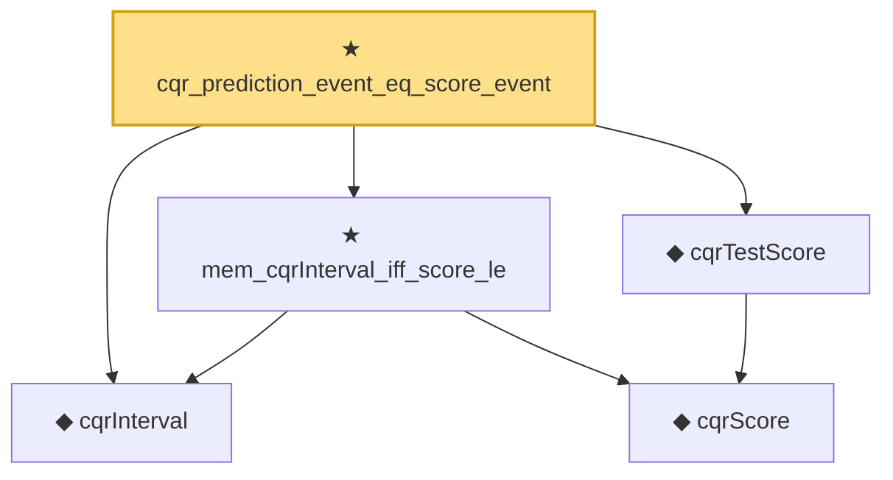

# Proof narrative — cqr_prediction_event_eq_score_event

Root: **cqr_prediction_event_eq_score_event** (theorem) `Statlib/Nonparametric/ConformalQuantileRegression.lean:32` · topic `Nonparametric`
Closure: 5 declarations across 2 files. Generated from `proof_graph.json` — no files were moved.

Reading order (foundations first, headline last):

  ◆ `cqrInterval` — def · `Statlib/Nonparametric/Vocabulary/ConformalQuantileRegression.lean:18`  _(also used by 2: cqr_miscoverage_event_eq_score_event, cqr_miscoverage_bound_of_score_miscoverage)_
    ◆ `cqrScore` — def · `Statlib/Nonparametric/Vocabulary/ConformalQuantileRegression.lean:14`  _(also used by 2: cqr_miscoverage_event_eq_score_event, cqrCalibrationScores)_
  ◆ `cqrTestScore` — def · `Statlib/Nonparametric/Vocabulary/ConformalQuantileRegression.lean:28`  _(also used by 2: cqr_miscoverage_event_eq_score_event, cqr_miscoverage_bound_of_score_miscoverage)_
  ★ `mem_cqrInterval_iff_score_le` — theorem · `Statlib/Nonparametric/ConformalQuantileRegression.lean:19`  _(also used by 1: cqr_miscoverage_event_eq_score_event)_
★ `cqr_prediction_event_eq_score_event` — theorem · `Statlib/Nonparametric/ConformalQuantileRegression.lean:32` **← headline**

## Dependency diagram

