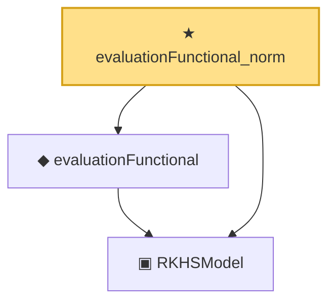

# Proof narrative — evaluationFunctional_norm

Root: **evaluationFunctional_norm** (theorem) `Statlib/Nonparametric/Approximation/RKHS.lean:124` · topic `Nonparametric`
Closure: 3 declarations across 2 files. Generated from `proof_graph.json` — no files were moved.

Reading order (foundations first, headline last):

  ▣ `RKHSModel` — structure · `Statlib/Nonparametric/Vocabulary/RKHS.lean:16`  _(also used by 28: rkhs_eval_bound, rkhsBall_uniform_bound, rkhsBall_lipschitz, …)_
  ◆ `evaluationFunctional` — noncomputable def · `Statlib/Nonparametric/Vocabulary/RKHS.lean:37`  _(also used by 1: evaluationFunctional_apply)_
★ `evaluationFunctional_norm` — theorem · `Statlib/Nonparametric/Approximation/RKHS.lean:124` **← headline**

## Dependency diagram

