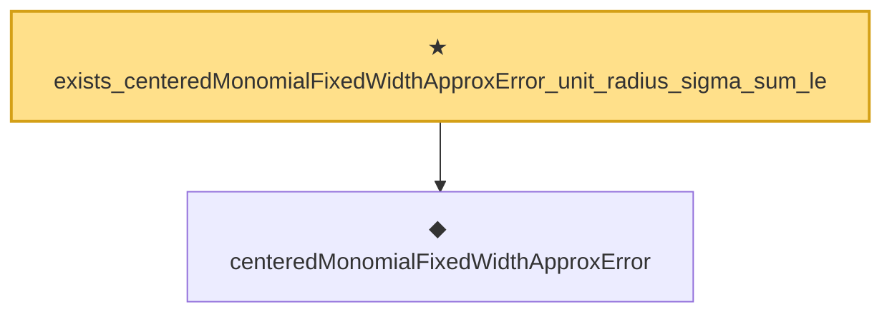

# Proof narrative — exists_centeredMonomialFixedWidthApproxError_unit_radius_sigma_sum_le

Root: **exists_centeredMonomialFixedWidthApproxError_unit_radius_sigma_sum_le** (theorem) `Statlib/Nonparametric/Approximation/NeuralNetworkAlgebra.lean:22945` · topic `Nonparametric`
Closure: 2 declarations across 2 files. Generated from `proof_graph.json` — no files were moved.

Reading order (foundations first, headline last):

  ◆ `centeredMonomialFixedWidthApproxError` — noncomputable def · `Statlib/Nonparametric/Vocabulary/NeuralNetwork.lean:94`  _(also used by 6: exists_reluNetworkClass_centered_monomial_fixed_width_depth_rate_from_mul_gadget, exists_reluNetworkClass_finite_centered_monomial_polynomial_fixed_width_depth_rate_from_mul_gadget, exists_reluNetworkClass_finite_centered_monomial_polynomial_fixed_width_depth_rate_uniform_coeff_bound_from_mul_gadget, …)_
★ `exists_centeredMonomialFixedWidthApproxError_unit_radius_sigma_sum_le` — theorem · `Statlib/Nonparametric/Approximation/NeuralNetworkAlgebra.lean:22945` **← headline**

## Dependency diagram

