# Proof narrative — exists_fullyConnectedReLUNet_finite_quadratic_polynomial_approx_on_box

Root: **exists_fullyConnectedReLUNet_finite_quadratic_polynomial_approx_on_box** (theorem) `Statlib/Nonparametric/Approximation/NeuralNetworkAlgebra.lean:1047` · topic `Nonparametric`
Closure: 29 declarations across 3 files. Generated from `proof_graph.json` — no files were moved.

Reading order (foundations first, headline last):

  ◆ `bias` — noncomputable def · `Statlib/Nonparametric/Vocabulary/Estimator.lean:28`  _(also used by 18: exists_fullyConnectedReLUNet_finite_linear_combination_approx, exists_fullyConnectedReLUNet_product_of_depth_one_approximants_on_box, exists_fullyConnectedReLUNet_finite_centered_monomial_polynomial_approx_on_box, …)_
    ▣ `DenseLayer` — structure · `Statlib/Nonparametric/Vocabulary/NeuralNetwork.lean:23`  _(also used by 12: exists_fullyConnectedReLUNet_finite_linear_combination_approx, exists_fullyConnectedReLUNet_product_of_depth_one_approximants_on_box, exists_fullyConnectedReLUNet_finite_centered_monomial_polynomial_approx_on_box, …)_
  ▣ `FullyConnectedReLUNet` — structure · `Statlib/Nonparametric/Vocabulary/NeuralNetwork.lean:167`  _(also used by 42: reluNetworkClass_classApproximationError_le_of_pointwise_candidate, reluNetworkClass_classApproximationError_le_of_candidate_ise, reluNetworkClass_classApproximationError_le_of_exists_pointwise, …)_
  ◆ `parameterCount` — def · `Statlib/Nonparametric/Vocabulary/NeuralNetwork.lean:39`  _(also used by 28: reluNetworkClass_classApproximationError_le_of_pointwise_candidate, reluNetworkClass_classApproximationError_le_of_candidate_ise, reluNetworkClass_classApproximationError_le_of_exists_pointwise, …)_
    ▣ `OneHiddenReLUNet` — structure · `Statlib/Nonparametric/Vocabulary/NeuralNetwork.lean:47`  _(also used by 3: parameterCount, mulPolarizationReLUHingeNet, oneHiddenReLUEmpiricalRisk)_
    ◆ `relu` — def · `Statlib/Nonparametric/Vocabulary/NeuralNetwork.lean:15`  _(also used by 37: exists_fullyConnectedReLUNet_product_of_depth_one_approximants_on_box, exists_fullyConnectedReLUNet_finite_centered_monomial_polynomial_approx_on_box, exists_fullyConnectedReLUNet_finite_centered_monomial_polynomial_approx_on_box_with_depth_bound, …)_
    ◆ `apply` — noncomputable def · `Statlib/Nonparametric/Vocabulary/NeuralNetwork.lean:30`  _(also used by 72: unit_cube_grid_finite_measurable_cover, kernel_holder_bias_integratedSquaredError_bound, classApproximationError_le_of_exists_pointwise_bound, …)_
  ◆ `realize` — noncomputable def · `Statlib/Nonparametric/Vocabulary/NeuralNetwork.lean:55`  _(also used by 46: reluNetworkClass_classApproximationError_le_of_pointwise_candidate, reluNetworkClass_classApproximationError_le_of_candidate_ise, reluNetworkClass_classApproximationError_le_of_exists_pointwise, …)_
  ◆ `finiteLinearCombination` — noncomputable def · `Statlib/Nonparametric/Vocabulary/NeuralNetwork.lean:384`  _(also used by 23: exists_fullyConnectedReLUNet_finite_linear_combination_approx, exists_fullyConnectedReLUNet_finite_centered_monomial_polynomial_approx_on_box, exists_fullyConnectedReLUNet_finite_centered_monomial_polynomial_approx_on_box_with_depth_bound, …)_
        ◆ `intervalSquareReLUHingeNet` — noncomputable def · `Statlib/Nonparametric/Vocabulary/NeuralNetwork.lean:292`  _(also used by 1: mulPolarizationReLUHingeNet)_
  ◆ `fullyConnectedReLUParameterCount` — def · `Statlib/Nonparametric/Vocabulary/NeuralNetwork.lean:70`  _(also used by 50: exists_fullyConnectedReLUNet_unitInterval_square_approx, exists_fullyConnectedReLUNet_finite_linear_combination_approx, exists_fullyConnectedReLUNet_product_of_depth_one_approximants_on_box, …)_
        ◆ `squareReLUHingeInterpolant` — noncomputable def · `Statlib/Nonparametric/Vocabulary/NeuralNetwork.lean:270`  _(also used by 1: exists_reluNetworkClass_unitInterval_square_fixed_width_depth_rate)_
        ◆ `unitIntervalSquareReLUHingeNet` — noncomputable def · `Statlib/Nonparametric/Vocabulary/NeuralNetwork.lean:277`  _(also used by 1: exists_fullyConnectedReLUNet_unitInterval_square_approx)_
        ★ `unitIntervalSquareReLUHingeNet_realize` — theorem · `Statlib/Nonparametric/Approximation/NeuralNetworkAlgebra.lean:160`  _(also used by 1: exists_fullyConnectedReLUNet_unitInterval_square_approx)_
        ◆ `toFullyConnected` — noncomputable def · `Statlib/Nonparametric/Vocabulary/NeuralNetwork.lean:207`  _(also used by 2: exists_fullyConnectedReLUNet_unitInterval_square_approx, exists_fullyConnectedReLUNet_finite_centered_monomial_polynomial_uniform_resolution_size_bound)_
    ◆ `reluVec` — def · `Statlib/Nonparametric/Vocabulary/NeuralNetwork.lean:19`  _(also used by 16: exists_fullyConnectedReLUNet_product_of_depth_one_approximants_on_box, exists_fullyConnectedReLUNet_finite_centered_monomial_polynomial_approx_on_box, exists_fullyConnectedReLUNet_finite_centered_monomial_polynomial_approx_on_box_with_depth_bound, …)_
    ◆ `reluApply` — noncomputable def · `Statlib/Nonparametric/Vocabulary/NeuralNetwork.lean:34`  _(also used by 16: exists_fullyConnectedReLUNet_product_of_depth_one_approximants_on_box, exists_fullyConnectedReLUNet_finite_centered_monomial_polynomial_approx_on_box, exists_fullyConnectedReLUNet_finite_centered_monomial_polynomial_approx_on_box_with_depth_bound, …)_
    ◆ `hiddenState` — noncomputable def · `Statlib/Nonparametric/Vocabulary/NeuralNetwork.lean:182`  _(also used by 17: exists_fullyConnectedReLUNet_product_of_depth_one_approximants_on_box, exists_fullyConnectedReLUNet_finite_centered_monomial_polynomial_approx_on_box, exists_fullyConnectedReLUNet_finite_centered_monomial_polynomial_approx_on_box_with_depth_bound, …)_
        ◆ `intervalSquareReLUHingeInterpolant` — noncomputable def · `Statlib/Nonparametric/Vocabulary/NeuralNetwork.lean:286`
            ◆ `squareSecantInterpolant` — noncomputable def · `Statlib/Nonparametric/Vocabulary/NeuralNetwork.lean:260`
            ◆ `squareCellInterpolant` — noncomputable def · `Statlib/Nonparametric/Vocabulary/NeuralNetwork.lean:265`
          ★ `squareReLUHingeInterpolant_error_le_of_mem_cell` — theorem · `Statlib/Nonparametric/Approximation/NeuralNetworkAlgebra.lean:18`
        ★ `squareReLUHingeInterpolant_error_le_of_mem_unitInterval` — theorem · `Statlib/Nonparametric/Approximation/NeuralNetworkAlgebra.lean:191`  _(also used by 2: exists_fullyConnectedReLUNet_unitInterval_square_approx, exists_reluNetworkClass_unitInterval_square_fixed_width_depth_rate)_
      ★ `exists_fullyConnectedReLUNet_interval_square_approx` — theorem · `Statlib/Nonparametric/Approximation/NeuralNetworkAlgebra.lean:253`
    ★ `exists_fullyConnectedReLUNet_mul_approx_on_box` — theorem · `Statlib/Nonparametric/Approximation/NeuralNetworkAlgebra.lean:462`  _(also used by 5: exists_fullyConnectedReLUNet_product_of_depth_one_approximants_on_box, exists_fullyConnectedReLUNet_finite_centered_monomial_polynomial_approx_on_box, exists_fullyConnectedReLUNet_finite_centered_monomial_polynomial_approx_on_box_with_depth_bound, …)_
  ★ `exists_fullyConnectedReLUNet_coordinate_mul_approx_on_box` — theorem · `Statlib/Nonparametric/Approximation/NeuralNetworkAlgebra.lean:755`  _(also used by 1: exists_fullyConnectedReLUNet_quadratic_two_term_approx_on_box)_
    ★ `exists_fullyConnectedReLUNet_linear_combination_two` — theorem · `Statlib/Nonparametric/Approximation/NeuralNetworkAlgebra.lean:714`  _(also used by 2: exists_fullyConnectedReLUNet_quadratic_two_term_approx_on_box, exists_fullyConnectedReLUNet_finite_centered_monomial_polynomial_uniform_resolution_size_bound)_
  ★ `exists_fullyConnectedReLUNet_linear_combination_two_approx` — theorem · `Statlib/Nonparametric/Approximation/NeuralNetworkAlgebra.lean:844`  _(also used by 1: exists_fullyConnectedReLUNet_finite_linear_combination_approx)_
★ `exists_fullyConnectedReLUNet_finite_quadratic_polynomial_approx_on_box` — theorem · `Statlib/Nonparametric/Approximation/NeuralNetworkAlgebra.lean:1047` **← headline**

## Dependency diagram

```mermaid
flowchart TD
  n0["◆ bias"]
  n1["▣ DenseLayer"]
  n2["▣ FullyConnectedReLUNet"]
  n3["◆ parameterCount"]
  n4["▣ OneHiddenReLUNet"]
  n5["◆ relu"]
  n6["◆ apply"]
  n7["◆ realize"]
  n8["◆ finiteLinearCombination"]
  n9["◆ intervalSquareReLUHingeNet"]
  n10["◆ fullyConnectedReLUParameterCount"]
  n11["◆ squareReLUHingeInterpolant"]
  n12["◆ unitIntervalSquareReLUHingeNet"]
  n13["★ unitIntervalSquareReLUHingeNet_realize"]
  n14["◆ toFullyConnected"]
  n15["◆ reluVec"]
  n16["◆ reluApply"]
  n17["◆ hiddenState"]
  n18["◆ intervalSquareReLUHingeInterpolant"]
  n19["◆ squareSecantInterpolant"]
  n20["◆ squareCellInterpolant"]
  n21["★ squareReLUHingeInterpolant_error_le_of_mem_cell"]
  n22["★ squareReLUHingeInterpolant_error_le_of_mem_unitInterval"]
  n23["★ exists_fullyConnectedReLUNet_interval_square_approx"]
  n24["★ exists_fullyConnectedReLUNet_mul_approx_on_box"]
  n25["★ exists_fullyConnectedReLUNet_coordinate_mul_approx_on_box"]
  n26["★ exists_fullyConnectedReLUNet_linear_combination_two"]
  n27["★ exists_fullyConnectedReLUNet_linear_combination_two_approx"]
  n28["★ exists_fullyConnectedReLUNet_finite_quadratic_polynomial_approx_on_box"]
  n1 --> n0
  n2 --> n1
  n3 --> n1
  n4 --> n1
  n6 --> n1
  n6 --> n0
  n7 --> n4
  n7 --> n5
  n7 --> n6
  n9 --> n4
  n9 --> n0
  n11 --> n5
  n12 --> n4
  n12 --> n0
  n13 --> n12
  n13 --> n7
  n13 --> n11
  n13 --> n6
  n13 --> n5
  n14 --> n4
  n14 --> n2
  n15 --> n5
  n16 --> n1
  n16 --> n15
  n16 --> n6
  n17 --> n2
  n17 --> n16
  n18 --> n5
  n18 --> n11
  n20 --> n19
  n21 --> n11
  n21 --> n20
  n21 --> n5
  n21 --> n6
  n21 --> n19
  n22 --> n11
  n22 --> n21
  n23 --> n2
  n23 --> n3
  n23 --> n7
  n23 --> n9
  n23 --> n10
  n23 --> n11
  n23 --> n5
  n23 --> n6
  n23 --> n12
  n23 --> n13
  n23 --> n14
  n23 --> n17
  n23 --> n16
  n23 --> n15
  n23 --> n18
  n23 --> n22
  n24 --> n2
  n24 --> n3
  n24 --> n7
  n24 --> n23
  n24 --> n0
  n24 --> n10
  n24 --> n6
  n24 --> n17
  n24 --> n16
  n24 --> n15
  n24 --> n5
  n25 --> n2
  n25 --> n3
  n25 --> n7
  n25 --> n24
  n25 --> n0
  n25 --> n10
  n25 --> n6
  n25 --> n16
  n25 --> n15
  n25 --> n17
  n26 --> n2
  n26 --> n3
  n26 --> n7
  n26 --> n0
  n26 --> n10
  n26 --> n17
  n26 --> n16
  n26 --> n15
  n26 --> n6
  n27 --> n2
  n27 --> n7
  n27 --> n3
  n27 --> n26
  n28 --> n2
  n28 --> n3
  n28 --> n7
  n28 --> n8
  n28 --> n25
  n28 --> n0
  n28 --> n10
  n28 --> n27
  class n28 headline;
  classDef headline fill:#ffe08a,stroke:#d4a017,stroke-width:2px;
  classDef axiomNode fill:#ffd0d0,stroke:#c0392b,stroke-dasharray:4 2;
```

