# Proof narrative — exists_fullyConnectedReLUNet_holderSmooth_local_approx_on_centered_box

Root: **exists_fullyConnectedReLUNet_holderSmooth_local_approx_on_centered_box** (theorem) `Statlib/Nonparametric/Approximation/NeuralNetworkAlgebra.lean:6096` · topic `Nonparametric`
Closure: 35 declarations across 4 files. Generated from `proof_graph.json` — no files were moved.

Reading order (foundations first, headline last):

    ◆ `FunctionClass` — abbrev · `Statlib/Nonparametric/Vocabulary/FunctionClasses.lean:16`  _(also used by 23: holder_class_approximation_error_le_of_net_member, kernel_smoother_classApproximationError_le_of_holder_bias_member, kernel_smoother_classApproximationError_le_of_holder_bias_rate, …)_
    ◆ `IsHolderFunction` — def · `Statlib/Nonparametric/Vocabulary/FunctionClasses.lean:44`  _(also used by 19: holder_net_sup_approximation_bound, holder_net_integrated_squared_error_bound, holder_class_approximation_error_le_of_net_member, …)_
    ◆ `IsHolderSmoothFunction` — def · `Statlib/Nonparametric/Vocabulary/FunctionClasses.lean:73`  _(also used by 2: unit_cube_bspline_zero_order_holder_projection_rate_of_support_node, tensor_product_linear_bspline_holder_projection_rate_of_local_partition)_
    ◆ `holderBall` — def · `Statlib/Nonparametric/Vocabulary/FunctionClasses.lean:60`  _(also used by 14: holder_ball_class_approximation_error_self_le_zero, selector_indicator_uniform_sieve_holder_approximation_bound, exists_selector_indicator_sieve_holder_approximation_bound_of_finite_net, …)_
  ◆ `holderSmoothBall` — def · `Statlib/Nonparametric/Vocabulary/FunctionClasses.lean:86`  _(also used by 75: holderSmoothBall_finite_centered_coordinate_polynomial_error_on_norm_ball, exists_fullyConnectedReLUNet_holderSmooth_local_approx_on_centered_box_with_size_bound, exists_fullyConnectedReLUNet_holderSmooth_local_approx_on_centered_box_with_depth_bound, …)_
      ◆ `bias` — noncomputable def · `Statlib/Nonparametric/Vocabulary/Estimator.lean:28`  _(also used by 20: exists_fullyConnectedReLUNet_linear_combination_two, exists_fullyConnectedReLUNet_coordinate_mul_approx_on_box, exists_fullyConnectedReLUNet_finite_linear_combination_approx, …)_
    ▣ `DenseLayer` — structure · `Statlib/Nonparametric/Vocabulary/NeuralNetwork.lean:23`  _(also used by 11: exists_fullyConnectedReLUNet_finite_linear_combination_approx, exists_fullyConnectedReLUNet_product_of_depth_one_approximants_on_box, exists_fullyConnectedReLUNet_finite_centered_monomial_polynomial_approx_on_box_with_depth_bound, …)_
  ▣ `FullyConnectedReLUNet` — structure · `Statlib/Nonparametric/Vocabulary/NeuralNetwork.lean:167`  _(also used by 43: reluNetworkClass_classApproximationError_le_of_pointwise_candidate, reluNetworkClass_classApproximationError_le_of_candidate_ise, reluNetworkClass_classApproximationError_le_of_exists_pointwise, …)_
    ▣ `OneHiddenReLUNet` — structure · `Statlib/Nonparametric/Vocabulary/NeuralNetwork.lean:47`  _(also used by 3: parameterCount, mulPolarizationReLUHingeNet, oneHiddenReLUEmpiricalRisk)_
    ◆ `relu` — def · `Statlib/Nonparametric/Vocabulary/NeuralNetwork.lean:15`  _(also used by 36: exists_fullyConnectedReLUNet_product_of_depth_one_approximants_on_box, exists_fullyConnectedReLUNet_finite_centered_monomial_polynomial_approx_on_box_with_depth_bound, exists_fullyConnectedReLUNet_finite_centered_monomial_polynomial_uniform_resolution_size_bound, …)_
    ◆ `apply` — noncomputable def · `Statlib/Nonparametric/Vocabulary/NeuralNetwork.lean:30`  _(also used by 71: unit_cube_grid_finite_measurable_cover, kernel_holder_bias_integratedSquaredError_bound, classApproximationError_le_of_exists_pointwise_bound, …)_
  ◆ `realize` — noncomputable def · `Statlib/Nonparametric/Vocabulary/NeuralNetwork.lean:55`  _(also used by 47: reluNetworkClass_classApproximationError_le_of_pointwise_candidate, reluNetworkClass_classApproximationError_le_of_candidate_ise, reluNetworkClass_classApproximationError_le_of_exists_pointwise, …)_
      ◆ `finiteLinearCombination` — noncomputable def · `Statlib/Nonparametric/Vocabulary/NeuralNetwork.lean:384`  _(also used by 22: exists_fullyConnectedReLUNet_finite_linear_combination_approx, exists_fullyConnectedReLUNet_finite_quadratic_polynomial_approx_on_box, exists_fullyConnectedReLUNet_finite_centered_monomial_polynomial_approx_on_box_with_depth_bound, …)_
      ◆ `reluVec` — def · `Statlib/Nonparametric/Vocabulary/NeuralNetwork.lean:19`  _(also used by 17: exists_fullyConnectedReLUNet_linear_combination_two, exists_fullyConnectedReLUNet_coordinate_mul_approx_on_box, exists_fullyConnectedReLUNet_product_of_depth_one_approximants_on_box, …)_
      ◆ `reluApply` — noncomputable def · `Statlib/Nonparametric/Vocabulary/NeuralNetwork.lean:34`  _(also used by 17: exists_fullyConnectedReLUNet_linear_combination_two, exists_fullyConnectedReLUNet_coordinate_mul_approx_on_box, exists_fullyConnectedReLUNet_product_of_depth_one_approximants_on_box, …)_
      ◆ `hiddenState` — noncomputable def · `Statlib/Nonparametric/Vocabulary/NeuralNetwork.lean:182`  _(also used by 18: exists_fullyConnectedReLUNet_linear_combination_two, exists_fullyConnectedReLUNet_coordinate_mul_approx_on_box, exists_fullyConnectedReLUNet_product_of_depth_one_approximants_on_box, …)_
        ◆ `parameterCount` — def · `Statlib/Nonparametric/Vocabulary/NeuralNetwork.lean:39`  _(also used by 32: reluNetworkClass_classApproximationError_le_of_pointwise_candidate, reluNetworkClass_classApproximationError_le_of_candidate_ise, reluNetworkClass_classApproximationError_le_of_exists_pointwise, …)_
          ◆ `intervalSquareReLUHingeNet` — noncomputable def · `Statlib/Nonparametric/Vocabulary/NeuralNetwork.lean:292`  _(also used by 1: mulPolarizationReLUHingeNet)_
        ◆ `fullyConnectedReLUParameterCount` — def · `Statlib/Nonparametric/Vocabulary/NeuralNetwork.lean:70`  _(also used by 53: exists_fullyConnectedReLUNet_unitInterval_square_approx, exists_fullyConnectedReLUNet_linear_combination_two, exists_fullyConnectedReLUNet_coordinate_mul_approx_on_box, …)_
          ◆ `squareReLUHingeInterpolant` — noncomputable def · `Statlib/Nonparametric/Vocabulary/NeuralNetwork.lean:270`  _(also used by 1: exists_reluNetworkClass_unitInterval_square_fixed_width_depth_rate)_
          ◆ `unitIntervalSquareReLUHingeNet` — noncomputable def · `Statlib/Nonparametric/Vocabulary/NeuralNetwork.lean:277`  _(also used by 1: exists_fullyConnectedReLUNet_unitInterval_square_approx)_
          ★ `unitIntervalSquareReLUHingeNet_realize` — theorem · `Statlib/Nonparametric/Approximation/NeuralNetworkAlgebra.lean:160`  _(also used by 1: exists_fullyConnectedReLUNet_unitInterval_square_approx)_
          ◆ `toFullyConnected` — noncomputable def · `Statlib/Nonparametric/Vocabulary/NeuralNetwork.lean:207`  _(also used by 2: exists_fullyConnectedReLUNet_unitInterval_square_approx, exists_fullyConnectedReLUNet_finite_centered_monomial_polynomial_uniform_resolution_size_bound)_
          ◆ `intervalSquareReLUHingeInterpolant` — noncomputable def · `Statlib/Nonparametric/Vocabulary/NeuralNetwork.lean:286`
            ◆ `squareSecantInterpolant` — noncomputable def · `Statlib/Nonparametric/Vocabulary/NeuralNetwork.lean:260`
            ◆ `squareCellInterpolant` — noncomputable def · `Statlib/Nonparametric/Vocabulary/NeuralNetwork.lean:265`
            ★ `squareReLUHingeInterpolant_error_le_of_mem_cell` — theorem · `Statlib/Nonparametric/Approximation/NeuralNetworkAlgebra.lean:18`
          ★ `squareReLUHingeInterpolant_error_le_of_mem_unitInterval` — theorem · `Statlib/Nonparametric/Approximation/NeuralNetworkAlgebra.lean:191`  _(also used by 2: exists_fullyConnectedReLUNet_unitInterval_square_approx, exists_reluNetworkClass_unitInterval_square_fixed_width_depth_rate)_
        ★ `exists_fullyConnectedReLUNet_interval_square_approx` — theorem · `Statlib/Nonparametric/Approximation/NeuralNetworkAlgebra.lean:253`
      ★ `exists_fullyConnectedReLUNet_mul_approx_on_box` — theorem · `Statlib/Nonparametric/Approximation/NeuralNetworkAlgebra.lean:462`  _(also used by 5: exists_fullyConnectedReLUNet_coordinate_mul_approx_on_box, exists_fullyConnectedReLUNet_product_of_depth_one_approximants_on_box, exists_fullyConnectedReLUNet_finite_centered_monomial_polynomial_approx_on_box_with_depth_bound, …)_
    ★ `exists_fullyConnectedReLUNet_finite_centered_monomial_polynomial_approx_on_box` — theorem · `Statlib/Nonparametric/Approximation/NeuralNetworkAlgebra.lean:1539`
    ★ `taylor_polynomial_as_finite_centered_coordinate_polynomial` — theorem · `Statlib/Nonparametric/Approximation/NeuralNetworkAlgebra.lean:4315`  _(also used by 5: holderSmoothBall_finite_centered_coordinate_polynomial_error_on_norm_ball, exists_fullyConnectedReLUNet_taylor_polynomial_approx_on_centered_box_with_size_bound, exists_fullyConnectedReLUNet_taylor_polynomial_approx_on_centered_box_with_depth_bound, …)_
  ★ `exists_fullyConnectedReLUNet_taylor_polynomial_approx_on_centered_box` — theorem · `Statlib/Nonparametric/Approximation/NeuralNetworkAlgebra.lean:4431`
  ★ `holderSmoothBall_taylor_remainder_bound_on_box` — theorem · `Statlib/Nonparametric/Approximation/NeuralNetworkAlgebra.lean:2533`  _(also used by 3: holderSmoothBall_finite_centered_coordinate_polynomial_error_on_norm_ball, exists_fullyConnectedReLUNet_holderSmooth_local_approx_on_centered_box_with_size_bound, finite_holderSmooth_local_table_reluNetworkClass_active_cell_error_and_domain_output_bound)_
★ `exists_fullyConnectedReLUNet_holderSmooth_local_approx_on_centered_box` — theorem · `Statlib/Nonparametric/Approximation/NeuralNetworkAlgebra.lean:6096` **← headline**

## Dependency diagram

```mermaid
flowchart TD
  n0["◆ FunctionClass"]
  n1["◆ IsHolderFunction"]
  n2["◆ IsHolderSmoothFunction"]
  n3["◆ holderBall"]
  n4["◆ holderSmoothBall"]
  n5["◆ bias"]
  n6["▣ DenseLayer"]
  n7["▣ FullyConnectedReLUNet"]
  n8["▣ OneHiddenReLUNet"]
  n9["◆ relu"]
  n10["◆ apply"]
  n11["◆ realize"]
  n12["◆ finiteLinearCombination"]
  n13["◆ reluVec"]
  n14["◆ reluApply"]
  n15["◆ hiddenState"]
  n16["◆ parameterCount"]
  n17["◆ intervalSquareReLUHingeNet"]
  n18["◆ fullyConnectedReLUParameterCount"]
  n19["◆ squareReLUHingeInterpolant"]
  n20["◆ unitIntervalSquareReLUHingeNet"]
  n21["★ unitIntervalSquareReLUHingeNet_realize"]
  n22["◆ toFullyConnected"]
  n23["◆ intervalSquareReLUHingeInterpolant"]
  n24["◆ squareSecantInterpolant"]
  n25["◆ squareCellInterpolant"]
  n26["★ squareReLUHingeInterpolant_error_le_of_mem_cell"]
  n27["★ squareReLUHingeInterpolant_error_le_of_mem_unitInterval"]
  n28["★ exists_fullyConnectedReLUNet_interval_square_approx"]
  n29["★ exists_fullyConnectedReLUNet_mul_approx_on_box"]
  n30["★ exists_fullyConnectedReLUNet_finite_centered_monomial_polynomial_approx_on_box"]
  n31["★ taylor_polynomial_as_finite_centered_coordinate_polynomial"]
  n32["★ exists_fullyConnectedReLUNet_taylor_polynomial_approx_on_centered_box"]
  n33["★ holderSmoothBall_taylor_remainder_bound_on_box"]
  n34["★ exists_fullyConnectedReLUNet_holderSmooth_local_approx_on_centered_box"]
  n2 --> n1
  n3 --> n0
  n3 --> n1
  n4 --> n0
  n4 --> n2
  n4 --> n1
  n4 --> n3
  n6 --> n5
  n7 --> n6
  n8 --> n6
  n10 --> n6
  n10 --> n5
  n11 --> n8
  n11 --> n9
  n11 --> n10
  n13 --> n9
  n14 --> n6
  n14 --> n13
  n14 --> n10
  n15 --> n7
  n15 --> n14
  n16 --> n6
  n17 --> n8
  n17 --> n5
  n19 --> n9
  n20 --> n8
  n20 --> n5
  n21 --> n20
  n21 --> n11
  n21 --> n19
  n21 --> n10
  n21 --> n9
  n22 --> n8
  n22 --> n7
  n23 --> n9
  n23 --> n19
  n25 --> n24
  n26 --> n19
  n26 --> n25
  n26 --> n9
  n26 --> n10
  n26 --> n24
  n27 --> n19
  n27 --> n26
  n28 --> n7
  n28 --> n16
  n28 --> n11
  n28 --> n17
  n28 --> n18
  n28 --> n19
  n28 --> n9
  n28 --> n10
  n28 --> n20
  n28 --> n21
  n28 --> n22
  n28 --> n15
  n28 --> n14
  n28 --> n13
  n28 --> n23
  n28 --> n27
  n29 --> n7
  n29 --> n16
  n29 --> n11
  n29 --> n28
  n29 --> n5
  n29 --> n18
  n29 --> n10
  n29 --> n15
  n29 --> n14
  n29 --> n13
  n29 --> n9
  n30 --> n7
  n30 --> n11
  n30 --> n12
  n30 --> n9
  n30 --> n5
  n30 --> n10
  n30 --> n15
  n30 --> n14
  n30 --> n13
  n30 --> n6
  n30 --> n29
  n31 --> n12
  n31 --> n10
  n32 --> n7
  n32 --> n11
  n32 --> n30
  n32 --> n31
  n33 --> n4
  n33 --> n1
  n33 --> n10
  n34 --> n4
  n34 --> n7
  n34 --> n11
  n34 --> n32
  n34 --> n33
  class n34 headline;
  classDef headline fill:#ffe08a,stroke:#d4a017,stroke-width:2px;
  classDef axiomNode fill:#ffd0d0,stroke:#c0392b,stroke-dasharray:4 2;
```

