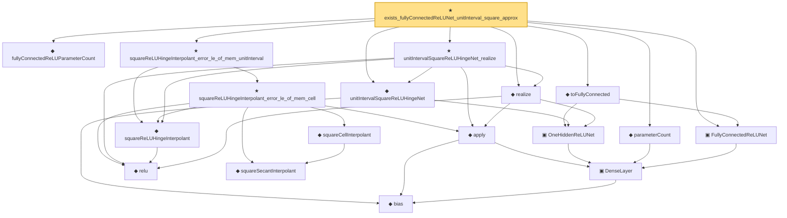

# Proof narrative — exists_fullyConnectedReLUNet_unitInterval_square_approx

Root: **exists_fullyConnectedReLUNet_unitInterval_square_approx** (theorem) `Statlib/Nonparametric/Approximation/NeuralNetworkAlgebra.lean:231` · topic `Nonparametric`
Closure: 18 declarations across 3 files. Generated from `proof_graph.json` — no files were moved.

Reading order (foundations first, headline last):

    ◆ `bias` — noncomputable def · `Statlib/Nonparametric/Vocabulary/Estimator.lean:28`  _(also used by 23: exists_fullyConnectedReLUNet_mul_approx_on_box, exists_fullyConnectedReLUNet_linear_combination_two, exists_fullyConnectedReLUNet_coordinate_mul_approx_on_box, …)_
    ▣ `DenseLayer` — structure · `Statlib/Nonparametric/Vocabulary/NeuralNetwork.lean:23`  _(also used by 13: exists_fullyConnectedReLUNet_finite_linear_combination_approx, exists_fullyConnectedReLUNet_product_of_depth_one_approximants_on_box, exists_fullyConnectedReLUNet_finite_centered_monomial_polynomial_approx_on_box, …)_
  ▣ `FullyConnectedReLUNet` — structure · `Statlib/Nonparametric/Vocabulary/NeuralNetwork.lean:167`  _(also used by 48: reluNetworkClass_classApproximationError_le_of_pointwise_candidate, reluNetworkClass_classApproximationError_le_of_candidate_ise, reluNetworkClass_classApproximationError_le_of_exists_pointwise, …)_
  ◆ `parameterCount` — def · `Statlib/Nonparametric/Vocabulary/NeuralNetwork.lean:39`  _(also used by 33: reluNetworkClass_classApproximationError_le_of_pointwise_candidate, reluNetworkClass_classApproximationError_le_of_candidate_ise, reluNetworkClass_classApproximationError_le_of_exists_pointwise, …)_
    ▣ `OneHiddenReLUNet` — structure · `Statlib/Nonparametric/Vocabulary/NeuralNetwork.lean:47`  _(also used by 4: parameterCount, intervalSquareReLUHingeNet, mulPolarizationReLUHingeNet, …)_
    ◆ `relu` — def · `Statlib/Nonparametric/Vocabulary/NeuralNetwork.lean:15`  _(also used by 41: exists_fullyConnectedReLUNet_interval_square_approx, exists_fullyConnectedReLUNet_mul_approx_on_box, exists_fullyConnectedReLUNet_product_of_depth_one_approximants_on_box, …)_
    ◆ `apply` — noncomputable def · `Statlib/Nonparametric/Vocabulary/NeuralNetwork.lean:30`  _(also used by 77: unit_cube_grid_finite_measurable_cover, kernel_holder_bias_integratedSquaredError_bound, classApproximationError_le_of_exists_pointwise_bound, …)_
  ◆ `realize` — noncomputable def · `Statlib/Nonparametric/Vocabulary/NeuralNetwork.lean:55`  _(also used by 51: reluNetworkClass_classApproximationError_le_of_pointwise_candidate, reluNetworkClass_classApproximationError_le_of_candidate_ise, reluNetworkClass_classApproximationError_le_of_exists_pointwise, …)_
  ◆ `unitIntervalSquareReLUHingeNet` — noncomputable def · `Statlib/Nonparametric/Vocabulary/NeuralNetwork.lean:277`  _(also used by 1: exists_fullyConnectedReLUNet_interval_square_approx)_
  ◆ `toFullyConnected` — noncomputable def · `Statlib/Nonparametric/Vocabulary/NeuralNetwork.lean:207`  _(also used by 2: exists_fullyConnectedReLUNet_interval_square_approx, exists_fullyConnectedReLUNet_finite_centered_monomial_polynomial_uniform_resolution_size_bound)_
  ◆ `fullyConnectedReLUParameterCount` — def · `Statlib/Nonparametric/Vocabulary/NeuralNetwork.lean:70`  _(also used by 54: exists_fullyConnectedReLUNet_interval_square_approx, exists_fullyConnectedReLUNet_mul_approx_on_box, exists_fullyConnectedReLUNet_linear_combination_two, …)_
    ◆ `squareReLUHingeInterpolant` — noncomputable def · `Statlib/Nonparametric/Vocabulary/NeuralNetwork.lean:270`  _(also used by 3: exists_fullyConnectedReLUNet_interval_square_approx, exists_reluNetworkClass_unitInterval_square_fixed_width_depth_rate, intervalSquareReLUHingeInterpolant)_
  ★ `unitIntervalSquareReLUHingeNet_realize` — theorem · `Statlib/Nonparametric/Approximation/NeuralNetworkAlgebra.lean:160`  _(also used by 1: exists_fullyConnectedReLUNet_interval_square_approx)_
      ◆ `squareSecantInterpolant` — noncomputable def · `Statlib/Nonparametric/Vocabulary/NeuralNetwork.lean:260`
      ◆ `squareCellInterpolant` — noncomputable def · `Statlib/Nonparametric/Vocabulary/NeuralNetwork.lean:265`
    ★ `squareReLUHingeInterpolant_error_le_of_mem_cell` — theorem · `Statlib/Nonparametric/Approximation/NeuralNetworkAlgebra.lean:18`
  ★ `squareReLUHingeInterpolant_error_le_of_mem_unitInterval` — theorem · `Statlib/Nonparametric/Approximation/NeuralNetworkAlgebra.lean:191`  _(also used by 2: exists_fullyConnectedReLUNet_interval_square_approx, exists_reluNetworkClass_unitInterval_square_fixed_width_depth_rate)_
★ `exists_fullyConnectedReLUNet_unitInterval_square_approx` — theorem · `Statlib/Nonparametric/Approximation/NeuralNetworkAlgebra.lean:231` **← headline**

## Dependency diagram

