# Proof narrative — exists_reluNetworkClass_holderSmooth_axisAligned_tent_partition_approximation_on_domain_bound

Root: **exists_reluNetworkClass_holderSmooth_axisAligned_tent_partition_approximation_on_domain_bound** (theorem) `Statlib/Nonparametric/Approximation/NeuralNetworkAlgebra.lean:8657` · topic `Nonparametric`
Closure: 56 declarations across 4 files. Generated from `proof_graph.json` — no files were moved.

Reading order (foundations first, headline last):

  ◆ `finiteCenteredMonomialPolynomialDepthBound` — def · `Statlib/Nonparametric/Vocabulary/NeuralNetwork.lean:137`  _(also used by 10: exists_reluNetworkClass_holderSmooth_local_approx_on_centered_box_with_symbolic_budget, finite_holderSmooth_local_table_reluNetworkClass_active_cell_error_bound, finite_holderSmooth_local_table_reluNetworkClass_active_cell_error_and_domain_output_bound, …)_
    ◆ `centeredMonomialWidthBound` — def · `Statlib/Nonparametric/Vocabulary/NeuralNetwork.lean:107`
  ◆ `finiteCenteredMonomialPolynomialWidthBound` — def · `Statlib/Nonparametric/Vocabulary/NeuralNetwork.lean:143`  _(also used by 11: exists_reluNetworkClass_holderSmooth_local_approx_on_centered_box_with_symbolic_budget, finite_holderSmooth_local_table_reluNetworkClass_active_cell_error_bound, finite_holderSmooth_local_table_reluNetworkClass_active_cell_error_and_domain_output_bound, …)_
  ◆ `fullyConnectedReLUParameterCount` — def · `Statlib/Nonparametric/Vocabulary/NeuralNetwork.lean:70`  _(also used by 43: exists_fullyConnectedReLUNet_unitInterval_square_approx, exists_fullyConnectedReLUNet_coordinate_mul_approx_on_box, exists_fullyConnectedReLUNet_finite_linear_combination_approx, …)_
  ◆ `finiteCenteredMonomialPolynomialParameterBound` — def · `Statlib/Nonparametric/Vocabulary/NeuralNetwork.lean:149`  _(also used by 8: exists_reluNetworkClass_holderSmooth_local_approx_on_centered_box_with_symbolic_budget, finite_holderSmooth_local_table_reluNetworkClass_active_cell_error_bound, finite_holderSmooth_local_table_reluNetworkClass_active_cell_error_and_domain_output_bound, …)_
    ◆ `FunctionClass` — abbrev · `Statlib/Nonparametric/Vocabulary/FunctionClasses.lean:16`  _(also used by 22: holder_class_approximation_error_le_of_net_member, kernel_smoother_classApproximationError_le_of_holder_bias_member, kernel_smoother_classApproximationError_le_of_holder_bias_rate, …)_
    ◆ `IsHolderFunction` — def · `Statlib/Nonparametric/Vocabulary/FunctionClasses.lean:44`  _(also used by 19: holder_net_sup_approximation_bound, holder_net_integrated_squared_error_bound, holder_class_approximation_error_le_of_net_member, …)_
    ◆ `IsHolderSmoothFunction` — def · `Statlib/Nonparametric/Vocabulary/FunctionClasses.lean:73`  _(also used by 2: unit_cube_bspline_zero_order_holder_projection_rate_of_support_node, tensor_product_linear_bspline_holder_projection_rate_of_local_partition)_
    ◆ `holderBall` — def · `Statlib/Nonparametric/Vocabulary/FunctionClasses.lean:60`  _(also used by 14: holder_ball_class_approximation_error_self_le_zero, selector_indicator_uniform_sieve_holder_approximation_bound, exists_selector_indicator_sieve_holder_approximation_bound_of_finite_net, …)_
  ◆ `holderSmoothBall` — def · `Statlib/Nonparametric/Vocabulary/FunctionClasses.lean:86`  _(also used by 73: holderSmoothBall_finite_centered_coordinate_polynomial_error_on_norm_ball, exists_fullyConnectedReLUNet_holderSmooth_local_approx_on_centered_box, exists_fullyConnectedReLUNet_holderSmooth_local_approx_on_centered_box_with_depth_bound, …)_
  ◆ `relu` — def · `Statlib/Nonparametric/Vocabulary/NeuralNetwork.lean:15`  _(also used by 29: exists_fullyConnectedReLUNet_product_of_depth_one_approximants_on_box, exists_fullyConnectedReLUNet_finite_centered_monomial_polynomial_approx_on_box, exists_fullyConnectedReLUNet_finite_centered_monomial_polynomial_approx_on_box_with_depth_bound, …)_
  ◆ `coordinateTentReLUFunction` — noncomputable def · `Statlib/Nonparametric/Vocabulary/NeuralNetwork.lean:339`  _(also used by 4: coordinateTentReLUFunction_mem_reluNetworkClass_with_parameter_bound, exists_unitCube_axisAlignedBoxTentWeight_partition_data, exists_unitCube_axisAlignedBoxTentWeight_partition_data_with_domain_coord_bound, …)_
  ◆ `axisAlignedBoxTentWeight` — noncomputable def · `Statlib/Nonparametric/Vocabulary/NeuralNetwork.lean:379`  _(also used by 13: axisAlignedBoxTentWeight_partition_pointwise_approximation_error_bound, finite_axisAligned_tent_weighted_local_reluNetworkClass_global_error_bound, exists_reluNetworkClass_axisAligned_tent_partition_approximation_from_bounded_local_table_on_domain, …)_
  ◆ `centeredMonomialApproxError` — noncomputable def · `Statlib/Nonparametric/Vocabulary/NeuralNetwork.lean:79`  _(also used by 8: finite_holderSmooth_local_table_reluNetworkClass_active_cell_error_bound, finite_holderSmooth_local_table_reluNetworkClass_active_cell_error_and_domain_output_bound, exists_reluNetworkClass_holderSmooth_unitCube_approximation_from_geometry_and_coefficient_bound, …)_
    ◆ `bias` — noncomputable def · `Statlib/Nonparametric/Vocabulary/Estimator.lean:28`  _(also used by 15: exists_fullyConnectedReLUNet_coordinate_mul_approx_on_box, exists_fullyConnectedReLUNet_finite_linear_combination_approx, exists_fullyConnectedReLUNet_finite_quadratic_polynomial_approx_on_box, …)_
    ▣ `DenseLayer` — structure · `Statlib/Nonparametric/Vocabulary/NeuralNetwork.lean:23`  _(also used by 8: exists_fullyConnectedReLUNet_finite_linear_combination_approx, exists_fullyConnectedReLUNet_product_of_depth_one_approximants_on_box, exists_fullyConnectedReLUNet_finite_centered_monomial_polynomial_approx_on_box, …)_
  ◆ `parameterCount` — def · `Statlib/Nonparametric/Vocabulary/NeuralNetwork.lean:39`  _(also used by 22: reluNetworkClass_classApproximationError_le_of_pointwise_candidate, reluNetworkClass_classApproximationError_le_of_candidate_ise, reluNetworkClass_classApproximationError_le_of_exists_pointwise, …)_
  ▣ `FullyConnectedReLUNet` — structure · `Statlib/Nonparametric/Vocabulary/NeuralNetwork.lean:167`  _(also used by 33: reluNetworkClass_classApproximationError_le_of_pointwise_candidate, reluNetworkClass_classApproximationError_le_of_candidate_ise, reluNetworkClass_classApproximationError_le_of_exists_pointwise, …)_
      ▣ `OneHiddenReLUNet` — structure · `Statlib/Nonparametric/Vocabulary/NeuralNetwork.lean:47`  _(also used by 3: parameterCount, mulPolarizationReLUHingeNet, oneHiddenReLUEmpiricalRisk)_
  ◆ `apply` — noncomputable def · `Statlib/Nonparametric/Vocabulary/NeuralNetwork.lean:30`  _(also used by 65: unit_cube_grid_finite_measurable_cover, kernel_holder_bias_integratedSquaredError_bound, classApproximationError_le_of_exists_pointwise_bound, …)_
  ◆ `realize` — noncomputable def · `Statlib/Nonparametric/Vocabulary/NeuralNetwork.lean:55`  _(also used by 36: reluNetworkClass_classApproximationError_le_of_pointwise_candidate, reluNetworkClass_classApproximationError_le_of_candidate_ise, reluNetworkClass_classApproximationError_le_of_exists_pointwise, …)_
  ◆ `reluNetworkClass` — def · `Statlib/Nonparametric/Vocabulary/NeuralNetwork.lean:219`  _(also used by 42: reluNetworkClass_classApproximationError_le_of_pointwise_candidate, reluNetworkClass_classApproximationError_le_of_candidate_ise, reluNetworkClass_classApproximationError_le_of_exists_pointwise, …)_
    ◆ `finiteCenteredMonomialPolynomialApproxError` — noncomputable def · `Statlib/Nonparametric/Vocabulary/NeuralNetwork.lean:157`  _(also used by 4: exists_reluNetworkClass_holderSmooth_local_approx_on_centered_box_with_symbolic_budget, finite_holderSmooth_local_table_reluNetworkClass_active_cell_error_bound, finite_holderSmooth_local_table_reluNetworkClass_active_cell_error_and_domain_output_bound, …)_
  ◆ `finiteLinearCombination` — noncomputable def · `Statlib/Nonparametric/Vocabulary/NeuralNetwork.lean:384`  _(also used by 18: exists_fullyConnectedReLUNet_finite_linear_combination_approx, exists_fullyConnectedReLUNet_finite_quadratic_polynomial_approx_on_box, exists_fullyConnectedReLUNet_finite_centered_monomial_polynomial_approx_on_box, …)_
          ◆ `toFullyConnected` — noncomputable def · `Statlib/Nonparametric/Vocabulary/NeuralNetwork.lean:207`  _(also used by 1: exists_fullyConnectedReLUNet_unitInterval_square_approx)_
    ◆ `reluVec` — def · `Statlib/Nonparametric/Vocabulary/NeuralNetwork.lean:19`  _(also used by 12: exists_fullyConnectedReLUNet_coordinate_mul_approx_on_box, exists_fullyConnectedReLUNet_product_of_depth_one_approximants_on_box, exists_fullyConnectedReLUNet_finite_centered_monomial_polynomial_approx_on_box, …)_
    ◆ `reluApply` — noncomputable def · `Statlib/Nonparametric/Vocabulary/NeuralNetwork.lean:34`  _(also used by 12: exists_fullyConnectedReLUNet_coordinate_mul_approx_on_box, exists_fullyConnectedReLUNet_product_of_depth_one_approximants_on_box, exists_fullyConnectedReLUNet_finite_centered_monomial_polynomial_approx_on_box, …)_
    ◆ `hiddenState` — noncomputable def · `Statlib/Nonparametric/Vocabulary/NeuralNetwork.lean:182`  _(also used by 13: exists_fullyConnectedReLUNet_coordinate_mul_approx_on_box, exists_fullyConnectedReLUNet_product_of_depth_one_approximants_on_box, exists_fullyConnectedReLUNet_finite_centered_monomial_polynomial_approx_on_box, …)_
          ★ `exists_fullyConnectedReLUNet_linear_combination_two` — theorem · `Statlib/Nonparametric/Approximation/NeuralNetworkAlgebra.lean:714`  _(also used by 2: exists_fullyConnectedReLUNet_linear_combination_two_approx, exists_fullyConnectedReLUNet_quadratic_two_term_approx_on_box)_
            ◆ `intervalSquareReLUHingeNet` — noncomputable def · `Statlib/Nonparametric/Vocabulary/NeuralNetwork.lean:292`  _(also used by 1: mulPolarizationReLUHingeNet)_
            ◆ `squareReLUHingeInterpolant` — noncomputable def · `Statlib/Nonparametric/Vocabulary/NeuralNetwork.lean:270`  _(also used by 1: exists_reluNetworkClass_unitInterval_square_fixed_width_depth_rate)_
            ◆ `unitIntervalSquareReLUHingeNet` — noncomputable def · `Statlib/Nonparametric/Vocabulary/NeuralNetwork.lean:277`  _(also used by 1: exists_fullyConnectedReLUNet_unitInterval_square_approx)_
            ★ `unitIntervalSquareReLUHingeNet_realize` — theorem · `Statlib/Nonparametric/Approximation/NeuralNetworkAlgebra.lean:160`  _(also used by 1: exists_fullyConnectedReLUNet_unitInterval_square_approx)_
            ◆ `intervalSquareReLUHingeInterpolant` — noncomputable def · `Statlib/Nonparametric/Vocabulary/NeuralNetwork.lean:286`
            ◆ `squareSecantInterpolant` — noncomputable def · `Statlib/Nonparametric/Vocabulary/NeuralNetwork.lean:260`
            ◆ `squareCellInterpolant` — noncomputable def · `Statlib/Nonparametric/Vocabulary/NeuralNetwork.lean:265`
            ★ `squareReLUHingeInterpolant_error_le_of_mem_cell` — theorem · `Statlib/Nonparametric/Approximation/NeuralNetworkAlgebra.lean:18`
            ★ `squareReLUHingeInterpolant_error_le_of_mem_unitInterval` — theorem · `Statlib/Nonparametric/Approximation/NeuralNetworkAlgebra.lean:191`  _(also used by 2: exists_fullyConnectedReLUNet_unitInterval_square_approx, exists_reluNetworkClass_unitInterval_square_fixed_width_depth_rate)_
            ★ `exists_fullyConnectedReLUNet_interval_square_approx` — theorem · `Statlib/Nonparametric/Approximation/NeuralNetworkAlgebra.lean:253`
      ★ `exists_fullyConnectedReLUNet_mul_approx_on_box` — theorem · `Statlib/Nonparametric/Approximation/NeuralNetworkAlgebra.lean:462`  _(also used by 4: exists_fullyConnectedReLUNet_coordinate_mul_approx_on_box, exists_fullyConnectedReLUNet_product_of_depth_one_approximants_on_box, exists_fullyConnectedReLUNet_finite_centered_monomial_polynomial_approx_on_box, …)_
        ★ `exists_fullyConnectedReLUNet_finite_centered_monomial_polynomial_uniform_resolution_size_bound` — theorem · `Statlib/Nonparametric/Approximation/NeuralNetworkAlgebra.lean:4478`  _(also used by 2: exists_reluNetworkClass_holderSmooth_local_approx_on_centered_box_with_symbolic_budget, finite_holderSmooth_local_table_reluNetworkClass_active_cell_error_bound)_
        ★ `taylor_polynomial_as_finite_centered_coordinate_polynomial` — theorem · `Statlib/Nonparametric/Approximation/NeuralNetworkAlgebra.lean:4315`  _(also used by 5: exists_fullyConnectedReLUNet_taylor_polynomial_approx_on_centered_box, holderSmoothBall_finite_centered_coordinate_polynomial_error_on_norm_ball, exists_fullyConnectedReLUNet_taylor_polynomial_approx_on_centered_box_with_depth_bound, …)_
      ★ `exists_fullyConnectedReLUNet_taylor_polynomial_approx_on_centered_box_with_size_bound` — theorem · `Statlib/Nonparametric/Approximation/NeuralNetworkAlgebra.lean:5979`  _(also used by 1: finite_holderSmooth_local_table_reluNetworkClass_active_cell_error_and_domain_output_bound)_
      ★ `holderSmoothBall_taylor_remainder_bound_on_box` — theorem · `Statlib/Nonparametric/Approximation/NeuralNetworkAlgebra.lean:2533`  _(also used by 3: holderSmoothBall_finite_centered_coordinate_polynomial_error_on_norm_ball, exists_fullyConnectedReLUNet_holderSmooth_local_approx_on_centered_box, finite_holderSmooth_local_table_reluNetworkClass_active_cell_error_and_domain_output_bound)_
    ★ `exists_fullyConnectedReLUNet_holderSmooth_local_approx_on_centered_box_with_size_bound` — theorem · `Statlib/Nonparametric/Approximation/NeuralNetworkAlgebra.lean:6021`  _(also used by 1: exists_reluNetworkClass_holderSmooth_unitCube_approximation_with_coefficient_bound)_
  ★ `exists_reluNetworkClass_holderSmooth_local_approx_on_centered_box_with_coefficient_budget` — theorem · `Statlib/Nonparametric/Approximation/NeuralNetworkAlgebra.lean:6323`
    ◆ `coordinateTentReLUNet` — noncomputable def · `Statlib/Nonparametric/Vocabulary/NeuralNetwork.lean:346`  _(also used by 1: coordinateTentReLUFunction_mem_reluNetworkClass_with_parameter_bound)_
    ★ `coordinateTentReLUNet_realize` — theorem · `Statlib/Nonparametric/Approximation/NeuralNetworkAlgebra.lean:6701`
    ★ `exists_fullyConnectedReLUNet_product_approx_on_box_with_size_bound` — theorem · `Statlib/Nonparametric/Approximation/NeuralNetworkAlgebra.lean:6841`
  ★ `exists_reluNetworkClass_axisAlignedBoxTentWeight_approx_with_size_bound` — theorem · `Statlib/Nonparametric/Approximation/NeuralNetworkAlgebra.lean:7709`  _(also used by 2: exists_reluNetworkClass_axisAligned_tent_partition_approximation_from_bounded_local_table_on_domain, exists_reluNetworkClass_axisAlignedBoxTentWeight_fixed_width_depth_rate_from_mul_gadget)_
  ★ `exists_reluNetworkClass_weighted_local_product_approx_with_size_bound` — theorem · `Statlib/Nonparametric/Approximation/NeuralNetworkAlgebra.lean:8161`  _(also used by 1: exists_reluNetworkClass_axisAligned_tent_partition_approximation_from_bounded_local_table_on_domain)_
      ★ `exists_fullyConnectedReLUNet_finite_linear_combination_same_depth_approx` — theorem · `Statlib/Nonparametric/Approximation/NeuralNetworkAlgebra.lean:6427`
    ★ `finite_linear_combination_same_depth_reluNetworkClass_approximation_bound` — theorem · `Statlib/Nonparametric/Approximation/NeuralNetworkAlgebra.lean:7647`  _(also used by 1: finite_axisAligned_tent_weighted_local_reluNetworkClass_global_error_bound)_
  ★ `finite_linear_combination_reluNetworkClass_approximation_bound_from_class_members` — theorem · `Statlib/Nonparametric/Approximation/NeuralNetworkAlgebra.lean:8259`  _(also used by 4: exists_reluNetworkClass_axisAligned_tent_partition_approximation_from_bounded_local_table_on_domain, exists_reluNetworkClass_mul_fixed_width_depth_rate_on_box, exists_reluNetworkClass_finite_centered_monomial_polynomial_fixed_width_depth_rate_from_mul_gadget, …)_
  ★ `axisAlignedBoxTentWeight_bounds_and_support` — theorem · `Statlib/Nonparametric/Approximation/NeuralNetworkAlgebra.lean:6788`  _(also used by 5: axisAlignedBoxTentWeight_partition_pointwise_approximation_error_bound, exists_reluNetworkClass_axisAligned_tent_partition_approximation_from_bounded_local_table_on_domain, exists_reluNetworkClass_axisAlignedBoxTentWeight_fixed_width_depth_rate_from_mul_gadget, …)_
★ `exists_reluNetworkClass_holderSmooth_axisAligned_tent_partition_approximation_on_domain_bound` — theorem · `Statlib/Nonparametric/Approximation/NeuralNetworkAlgebra.lean:8657` **← headline**

## Dependency diagram

```mermaid
flowchart TD
  n0["◆ finiteCenteredMonomialPolynomialDepthBound"]
  n1["◆ centeredMonomialWidthBound"]
  n2["◆ finiteCenteredMonomialPolynomialWidthBound"]
  n3["◆ fullyConnectedReLUParameterCount"]
  n4["◆ finiteCenteredMonomialPolynomialParameterBound"]
  n5["◆ FunctionClass"]
  n6["◆ IsHolderFunction"]
  n7["◆ IsHolderSmoothFunction"]
  n8["◆ holderBall"]
  n9["◆ holderSmoothBall"]
  n10["◆ relu"]
  n11["◆ coordinateTentReLUFunction"]
  n12["◆ axisAlignedBoxTentWeight"]
  n13["◆ centeredMonomialApproxError"]
  n14["◆ bias"]
  n15["▣ DenseLayer"]
  n16["◆ parameterCount"]
  n17["▣ FullyConnectedReLUNet"]
  n18["▣ OneHiddenReLUNet"]
  n19["◆ apply"]
  n20["◆ realize"]
  n21["◆ reluNetworkClass"]
  n22["◆ finiteCenteredMonomialPolynomialApproxError"]
  n23["◆ finiteLinearCombination"]
  n24["◆ toFullyConnected"]
  n25["◆ reluVec"]
  n26["◆ reluApply"]
  n27["◆ hiddenState"]
  n28["★ exists_fullyConnectedReLUNet_linear_combination_two"]
  n29["◆ intervalSquareReLUHingeNet"]
  n30["◆ squareReLUHingeInterpolant"]
  n31["◆ unitIntervalSquareReLUHingeNet"]
  n32["★ unitIntervalSquareReLUHingeNet_realize"]
  n33["◆ intervalSquareReLUHingeInterpolant"]
  n34["◆ squareSecantInterpolant"]
  n35["◆ squareCellInterpolant"]
  n36["★ squareReLUHingeInterpolant_error_le_of_mem_cell"]
  n37["★ squareReLUHingeInterpolant_error_le_of_mem_unitInterval"]
  n38["★ exists_fullyConnectedReLUNet_interval_square_approx"]
  n39["★ exists_fullyConnectedReLUNet_mul_approx_on_box"]
  n40["★ exists_fullyConnectedReLUNet_finite_centered_monomial_polynomial_uniform_resolution_size_bound"]
  n41["★ taylor_polynomial_as_finite_centered_coordinate_polynomial"]
  n42["★ exists_fullyConnectedReLUNet_taylor_polynomial_approx_on_centered_box_with_size_bound"]
  n43["★ holderSmoothBall_taylor_remainder_bound_on_box"]
  n44["★ exists_fullyConnectedReLUNet_holderSmooth_local_approx_on_centered_box_with_size_bound"]
  n45["★ exists_reluNetworkClass_holderSmooth_local_approx_on_centered_box_with_coefficient_budget"]
  n46["◆ coordinateTentReLUNet"]
  n47["★ coordinateTentReLUNet_realize"]
  n48["★ exists_fullyConnectedReLUNet_product_approx_on_box_with_size_bound"]
  n49["★ exists_reluNetworkClass_axisAlignedBoxTentWeight_approx_with_size_bound"]
  n50["★ exists_reluNetworkClass_weighted_local_product_approx_with_size_bound"]
  n51["★ exists_fullyConnectedReLUNet_finite_linear_combination_same_depth_approx"]
  n52["★ finite_linear_combination_same_depth_reluNetworkClass_approximation_bound"]
  n53["★ finite_linear_combination_reluNetworkClass_approximation_bound_from_class_members"]
  n54["★ axisAlignedBoxTentWeight_bounds_and_support"]
  n55["★ exists_reluNetworkClass_holderSmooth_axisAligned_tent_partition_approximation_on_domain_bound"]
  n2 --> n1
  n4 --> n3
  n4 --> n0
  n4 --> n2
  n7 --> n6
  n8 --> n5
  n8 --> n6
  n9 --> n5
  n9 --> n7
  n9 --> n6
  n9 --> n8
  n11 --> n10
  n12 --> n11
  n15 --> n14
  n16 --> n15
  n17 --> n15
  n18 --> n15
  n19 --> n15
  n19 --> n14
  n20 --> n18
  n20 --> n10
  n20 --> n19
  n21 --> n16
  n21 --> n5
  n21 --> n17
  n21 --> n20
  n22 --> n13
  n24 --> n18
  n24 --> n17
  n25 --> n10
  n26 --> n15
  n26 --> n25
  n26 --> n19
  n27 --> n17
  n27 --> n26
  n28 --> n17
  n28 --> n16
  n28 --> n20
  n28 --> n14
  n28 --> n3
  n28 --> n27
  n28 --> n26
  n28 --> n25
  n28 --> n19
  n29 --> n18
  n29 --> n14
  n30 --> n10
  n31 --> n18
  n31 --> n14
  n32 --> n31
  n32 --> n20
  n32 --> n30
  n32 --> n19
  n32 --> n10
  n33 --> n10
  n33 --> n30
  n35 --> n34
  n36 --> n30
  n36 --> n35
  n36 --> n10
  n36 --> n19
  n36 --> n34
  n37 --> n30
  n37 --> n36
  n38 --> n17
  n38 --> n16
  n38 --> n20
  n38 --> n29
  n38 --> n3
  n38 --> n30
  n38 --> n10
  n38 --> n19
  n38 --> n31
  n38 --> n32
  n38 --> n24
  n38 --> n27
  n38 --> n26
  n38 --> n25
  n38 --> n33
  n38 --> n37
  n39 --> n17
  n39 --> n16
  n39 --> n20
  n39 --> n38
  n39 --> n14
  n39 --> n3
  n39 --> n19
  n39 --> n27
  n39 --> n26
  n39 --> n25
  n39 --> n10
  n40 --> n17
  n40 --> n0
  n40 --> n2
  n40 --> n16
  n40 --> n4
  n40 --> n20
  n40 --> n23
  n40 --> n22
  n40 --> n1
  n40 --> n13
  n40 --> n24
  n40 --> n14
  n40 --> n27
  n40 --> n26
  n40 --> n19
  n40 --> n25
  n40 --> n10
  n40 --> n28
  n40 --> n39
  n40 --> n15
  n40 --> n3
  n41 --> n23
  n41 --> n19
  n42 --> n17
  n42 --> n0
  n42 --> n2
  n42 --> n16
  n42 --> n4
  n42 --> n20
  n42 --> n22
  n42 --> n40
  n42 --> n41
  n43 --> n9
  n43 --> n6
  n43 --> n19
  n44 --> n9
  n44 --> n17
  n44 --> n0
  n44 --> n2
  n44 --> n16
  n44 --> n4
  n44 --> n20
  n44 --> n22
  n44 --> n42
  n44 --> n43
  n45 --> n0
  n45 --> n2
  n45 --> n4
  n45 --> n9
  n45 --> n13
  n45 --> n21
  n45 --> n44
  n45 --> n20
  n45 --> n22
  n46 --> n17
  n46 --> n14
  n47 --> n46
  n47 --> n20
  n47 --> n11
  n47 --> n19
  n47 --> n26
  n47 --> n10
  n47 --> n25
  n47 --> n27
  n48 --> n17
  n48 --> n20
  n48 --> n16
  n48 --> n3
  n48 --> n15
  n48 --> n26
  n48 --> n25
  n48 --> n19
  n48 --> n10
  n48 --> n27
  n48 --> n39
  n48 --> n14
  n49 --> n3
  n49 --> n21
  n49 --> n12
  n49 --> n17
  n49 --> n16
  n49 --> n20
  n49 --> n11
  n49 --> n14
  n49 --> n46
  n49 --> n47
  n49 --> n10
  n49 --> n48
  n50 --> n17
  n50 --> n20
  n50 --> n3
  n50 --> n21
  n50 --> n48
  n51 --> n17
  n51 --> n20
  n51 --> n16
  n51 --> n3
  n51 --> n23
  n51 --> n15
  n51 --> n14
  n51 --> n26
  n51 --> n19
  n51 --> n25
  n51 --> n27
  n52 --> n17
  n52 --> n3
  n52 --> n20
  n52 --> n21
  n52 --> n23
  n52 --> n51
  n53 --> n21
  n53 --> n3
  n53 --> n23
  n53 --> n17
  n53 --> n20
  n53 --> n15
  n53 --> n26
  n53 --> n25
  n53 --> n10
  n53 --> n19
  n53 --> n27
  n53 --> n16
  n53 --> n52
  n54 --> n12
  n54 --> n10
  n54 --> n11
  n55 --> n0
  n55 --> n2
  n55 --> n4
  n55 --> n9
  n55 --> n12
  n55 --> n13
  n55 --> n10
  n55 --> n21
  n55 --> n3
  n55 --> n45
  n55 --> n49
  n55 --> n17
  n55 --> n16
  n55 --> n20
  n55 --> n11
  n55 --> n50
  n55 --> n53
  n55 --> n23
  n55 --> n54
  n55 --> n19
  class n55 headline;
  classDef headline fill:#ffe08a,stroke:#d4a017,stroke-width:2px;
  classDef axiomNode fill:#ffd0d0,stroke:#c0392b,stroke-dasharray:4 2;
```

