# Proof narrative — exists_reluNetworkClass_holderSmooth_unitCube_fixed_width_exact_grid_and_error_budget

Root: **exists_reluNetworkClass_holderSmooth_unitCube_fixed_width_exact_grid_and_error_budget** (theorem) `Statlib/Nonparametric/Approximation/NeuralNetworkAlgebra.lean:20070` · topic `Nonparametric`
Closure: 26 declarations across 5 files. Generated from `proof_graph.json` — no files were moved.

Reading order (foundations first, headline last):

    ◆ `FunctionClass` — abbrev · `Statlib/Nonparametric/Vocabulary/FunctionClasses.lean:16`  _(also used by 22: holder_class_approximation_error_le_of_net_member, kernel_smoother_classApproximationError_le_of_holder_bias_member, kernel_smoother_classApproximationError_le_of_holder_bias_rate, …)_
    ◆ `IsHolderFunction` — def · `Statlib/Nonparametric/Vocabulary/FunctionClasses.lean:44`  _(also used by 20: holder_net_sup_approximation_bound, holder_net_integrated_squared_error_bound, holder_class_approximation_error_le_of_net_member, …)_
    ◆ `IsHolderSmoothFunction` — def · `Statlib/Nonparametric/Vocabulary/FunctionClasses.lean:73`  _(also used by 2: unit_cube_bspline_zero_order_holder_projection_rate_of_support_node, tensor_product_linear_bspline_holder_projection_rate_of_local_partition)_
    ◆ `holderBall` — def · `Statlib/Nonparametric/Vocabulary/FunctionClasses.lean:60`  _(also used by 14: holder_ball_class_approximation_error_self_le_zero, selector_indicator_uniform_sieve_holder_approximation_bound, exists_selector_indicator_sieve_holder_approximation_bound_of_finite_net, …)_
  ◆ `holderSmoothBall` — def · `Statlib/Nonparametric/Vocabulary/FunctionClasses.lean:86`  _(also used by 76: holderSmoothBall_taylor_remainder_bound_on_box, holderSmoothBall_finite_centered_coordinate_polynomial_error_on_norm_ball, exists_fullyConnectedReLUNet_holderSmooth_local_approx_on_centered_box_with_size_bound, …)_
  ◆ `relu` — def · `Statlib/Nonparametric/Vocabulary/NeuralNetwork.lean:15`  _(also used by 38: squareReLUHingeInterpolant_error_le_of_mem_cell, unitIntervalSquareReLUHingeNet_realize, exists_fullyConnectedReLUNet_interval_square_approx, …)_
    ◆ `coordinateTentReLUFunction` — noncomputable def · `Statlib/Nonparametric/Vocabulary/NeuralNetwork.lean:339`  _(also used by 7: coordinateTentReLUNet_realize, coordinateTentReLUFunction_mem_reluNetworkClass_with_parameter_bound, exists_reluNetworkClass_axisAlignedBoxTentWeight_approx_with_size_bound, …)_
  ◆ `axisAlignedBoxTentWeight` — noncomputable def · `Statlib/Nonparametric/Vocabulary/NeuralNetwork.lean:379`  _(also used by 13: axisAlignedBoxTentWeight_partition_pointwise_approximation_error_bound, exists_reluNetworkClass_axisAlignedBoxTentWeight_approx_with_size_bound, finite_axisAligned_tent_weighted_local_reluNetworkClass_global_error_bound, …)_
      ◆ `bias` — noncomputable def · `Statlib/Nonparametric/Vocabulary/Estimator.lean:28`  _(also used by 23: exists_fullyConnectedReLUNet_mul_approx_on_box, exists_fullyConnectedReLUNet_linear_combination_two, exists_fullyConnectedReLUNet_coordinate_mul_approx_on_box, …)_
      ▣ `DenseLayer` — structure · `Statlib/Nonparametric/Vocabulary/NeuralNetwork.lean:23`  _(also used by 11: exists_fullyConnectedReLUNet_finite_linear_combination_approx, exists_fullyConnectedReLUNet_product_of_depth_one_approximants_on_box, exists_fullyConnectedReLUNet_finite_centered_monomial_polynomial_approx_on_box, …)_
    ◆ `parameterCount` — def · `Statlib/Nonparametric/Vocabulary/NeuralNetwork.lean:39`  _(also used by 32: reluNetworkClass_classApproximationError_le_of_pointwise_candidate, reluNetworkClass_classApproximationError_le_of_candidate_ise, reluNetworkClass_classApproximationError_le_of_exists_pointwise, …)_
    ▣ `FullyConnectedReLUNet` — structure · `Statlib/Nonparametric/Vocabulary/NeuralNetwork.lean:167`  _(also used by 47: reluNetworkClass_classApproximationError_le_of_pointwise_candidate, reluNetworkClass_classApproximationError_le_of_candidate_ise, reluNetworkClass_classApproximationError_le_of_exists_pointwise, …)_
      ▣ `OneHiddenReLUNet` — structure · `Statlib/Nonparametric/Vocabulary/NeuralNetwork.lean:47`  _(also used by 6: parameterCount, toFullyConnected, unitIntervalSquareReLUHingeNet, …)_
    ◆ `apply` — noncomputable def · `Statlib/Nonparametric/Vocabulary/NeuralNetwork.lean:30`  _(also used by 75: unit_cube_grid_finite_measurable_cover, kernel_holder_bias_integratedSquaredError_bound, classApproximationError_le_of_exists_pointwise_bound, …)_
    ◆ `realize` — noncomputable def · `Statlib/Nonparametric/Vocabulary/NeuralNetwork.lean:55`  _(also used by 51: reluNetworkClass_classApproximationError_le_of_pointwise_candidate, reluNetworkClass_classApproximationError_le_of_candidate_ise, reluNetworkClass_classApproximationError_le_of_exists_pointwise, …)_
  ◆ `reluNetworkClass` — def · `Statlib/Nonparametric/Vocabulary/NeuralNetwork.lean:219`  _(also used by 45: reluNetworkClass_classApproximationError_le_of_pointwise_candidate, reluNetworkClass_classApproximationError_le_of_candidate_ise, reluNetworkClass_classApproximationError_le_of_exists_pointwise, …)_
  ◆ `fullyConnectedReLUParameterCount` — def · `Statlib/Nonparametric/Vocabulary/NeuralNetwork.lean:70`  _(also used by 52: exists_fullyConnectedReLUNet_unitInterval_square_approx, exists_fullyConnectedReLUNet_interval_square_approx, exists_fullyConnectedReLUNet_mul_approx_on_box, …)_
      ◆ `finiteLinearCombination` — noncomputable def · `Statlib/Nonparametric/Vocabulary/NeuralNetwork.lean:384`  _(also used by 23: exists_fullyConnectedReLUNet_finite_linear_combination_approx, exists_fullyConnectedReLUNet_finite_quadratic_polynomial_approx_on_box, exists_fullyConnectedReLUNet_finite_centered_monomial_polynomial_approx_on_box, …)_
      ◆ `reluVec` — def · `Statlib/Nonparametric/Vocabulary/NeuralNetwork.lean:19`  _(also used by 19: exists_fullyConnectedReLUNet_interval_square_approx, exists_fullyConnectedReLUNet_mul_approx_on_box, exists_fullyConnectedReLUNet_linear_combination_two, …)_
      ◆ `reluApply` — noncomputable def · `Statlib/Nonparametric/Vocabulary/NeuralNetwork.lean:34`  _(also used by 19: exists_fullyConnectedReLUNet_interval_square_approx, exists_fullyConnectedReLUNet_mul_approx_on_box, exists_fullyConnectedReLUNet_linear_combination_two, …)_
      ◆ `hiddenState` — noncomputable def · `Statlib/Nonparametric/Vocabulary/NeuralNetwork.lean:182`  _(also used by 20: exists_fullyConnectedReLUNet_interval_square_approx, exists_fullyConnectedReLUNet_mul_approx_on_box, exists_fullyConnectedReLUNet_linear_combination_two, …)_
    ★ `finite_linear_combination_reluNetworkClass_serial_fixed_width_approximation_bound` — theorem · `Statlib/Nonparametric/Approximation/NeuralNetworkAlgebra.lean:14029`
    ★ `axisAlignedBoxTentWeight_bounds_and_support` — theorem · `Statlib/Nonparametric/Approximation/NeuralNetworkAlgebra.lean:6788`  _(also used by 5: axisAlignedBoxTentWeight_partition_pointwise_approximation_error_bound, exists_reluNetworkClass_holderSmooth_axisAligned_tent_partition_approximation_on_domain_bound, exists_reluNetworkClass_axisAligned_tent_partition_approximation_from_bounded_local_table_on_domain, …)_
    ★ `partition_of_unity_weighted_function_pointwise_approximation_error_bound` — theorem · `Statlib/Nonparametric/Approximation/Sieve.lean:501`  _(also used by 3: axisAlignedBoxTentWeight_partition_pointwise_approximation_error_bound, finite_axisAligned_tent_weighted_local_reluNetworkClass_serial_fixed_width_explicit_depth_global_error_bound, unitCubeBSplineQuasiInterpolantCertificate_exists_of_taylorStability)_
  ★ `finite_axisAligned_tent_weighted_local_reluNetworkClass_serial_fixed_width_global_error_bound` — theorem · `Statlib/Nonparametric/Approximation/NeuralNetworkAlgebra.lean:19541`
★ `exists_reluNetworkClass_holderSmooth_unitCube_fixed_width_exact_grid_and_error_budget` — theorem · `Statlib/Nonparametric/Approximation/NeuralNetworkAlgebra.lean:20070` **← headline**

## Dependency diagram

```mermaid
flowchart TD
  n0["◆ FunctionClass"]
  n1["◆ IsHolderFunction"]
  n2["◆ IsHolderSmoothFunction"]
  n3["◆ holderBall"]
  n4["◆ holderSmoothBall"]
  n5["◆ relu"]
  n6["◆ coordinateTentReLUFunction"]
  n7["◆ axisAlignedBoxTentWeight"]
  n8["◆ bias"]
  n9["▣ DenseLayer"]
  n10["◆ parameterCount"]
  n11["▣ FullyConnectedReLUNet"]
  n12["▣ OneHiddenReLUNet"]
  n13["◆ apply"]
  n14["◆ realize"]
  n15["◆ reluNetworkClass"]
  n16["◆ fullyConnectedReLUParameterCount"]
  n17["◆ finiteLinearCombination"]
  n18["◆ reluVec"]
  n19["◆ reluApply"]
  n20["◆ hiddenState"]
  n21["★ finite_linear_combination_reluNetworkClass_serial_fixed_width_approximation_bound"]
  n22["★ axisAlignedBoxTentWeight_bounds_and_support"]
  n23["★ partition_of_unity_weighted_function_pointwise_approximation_error_bound"]
  n24["★ finite_axisAligned_tent_weighted_local_reluNetworkClass_serial_fixed_width_global_error_bound"]
  n25["★ exists_reluNetworkClass_holderSmooth_unitCube_fixed_width_exact_grid_and_error_budget"]
  n2 --> n1
  n3 --> n0
  n3 --> n1
  n4 --> n0
  n4 --> n2
  n4 --> n1
  n4 --> n3
  n6 --> n5
  n7 --> n6
  n9 --> n8
  n10 --> n9
  n11 --> n9
  n12 --> n9
  n13 --> n9
  n13 --> n8
  n14 --> n12
  n14 --> n5
  n14 --> n13
  n15 --> n10
  n15 --> n0
  n15 --> n11
  n15 --> n14
  n18 --> n5
  n19 --> n9
  n19 --> n18
  n19 --> n13
  n20 --> n11
  n20 --> n19
  n21 --> n15
  n21 --> n16
  n21 --> n11
  n21 --> n10
  n21 --> n14
  n21 --> n17
  n21 --> n9
  n21 --> n8
  n21 --> n20
  n21 --> n5
  n21 --> n13
  n21 --> n19
  n21 --> n18
  n22 --> n7
  n22 --> n5
  n22 --> n6
  n23 --> n13
  n24 --> n15
  n24 --> n7
  n24 --> n5
  n24 --> n16
  n24 --> n21
  n24 --> n13
  n24 --> n22
  n24 --> n23
  n25 --> n4
  n25 --> n7
  n25 --> n15
  n25 --> n5
  n25 --> n16
  n25 --> n24
  class n25 headline;
  classDef headline fill:#ffe08a,stroke:#d4a017,stroke-width:2px;
  classDef axiomNode fill:#ffd0d0,stroke:#c0392b,stroke-dasharray:4 2;
```

