# Proof narrative — exists_reluNetworkClass_mul_fixed_width_depth_rate_on_box

Root: **exists_reluNetworkClass_mul_fixed_width_depth_rate_on_box** (theorem) `Statlib/Nonparametric/Approximation/NeuralNetworkAlgebra.lean:15477` · topic `Nonparametric`
Closure: 25 declarations across 4 files. Generated from `proof_graph.json` — no files were moved.

Reading order (foundations first, headline last):

  ◆ `fullyConnectedReLUParameterCount` — def · `Statlib/Nonparametric/Vocabulary/NeuralNetwork.lean:70`  _(also used by 50: exists_fullyConnectedReLUNet_unitInterval_square_approx, exists_fullyConnectedReLUNet_interval_square_approx, exists_fullyConnectedReLUNet_mul_approx_on_box, …)_
  ◆ `bias` — noncomputable def · `Statlib/Nonparametric/Vocabulary/Estimator.lean:28`  _(also used by 21: exists_fullyConnectedReLUNet_mul_approx_on_box, exists_fullyConnectedReLUNet_linear_combination_two, exists_fullyConnectedReLUNet_coordinate_mul_approx_on_box, …)_
    ▣ `DenseLayer` — structure · `Statlib/Nonparametric/Vocabulary/NeuralNetwork.lean:23`  _(also used by 10: exists_fullyConnectedReLUNet_finite_linear_combination_approx, exists_fullyConnectedReLUNet_product_of_depth_one_approximants_on_box, exists_fullyConnectedReLUNet_finite_centered_monomial_polynomial_approx_on_box, …)_
  ◆ `parameterCount` — def · `Statlib/Nonparametric/Vocabulary/NeuralNetwork.lean:39`  _(also used by 29: reluNetworkClass_classApproximationError_le_of_pointwise_candidate, reluNetworkClass_classApproximationError_le_of_candidate_ise, reluNetworkClass_classApproximationError_le_of_exists_pointwise, …)_
    ◆ `FunctionClass` — abbrev · `Statlib/Nonparametric/Vocabulary/FunctionClasses.lean:16`  _(also used by 24: holder_class_approximation_error_le_of_net_member, kernel_smoother_classApproximationError_le_of_holder_bias_member, kernel_smoother_classApproximationError_le_of_holder_bias_rate, …)_
  ▣ `FullyConnectedReLUNet` — structure · `Statlib/Nonparametric/Vocabulary/NeuralNetwork.lean:167`  _(also used by 43: reluNetworkClass_classApproximationError_le_of_pointwise_candidate, reluNetworkClass_classApproximationError_le_of_candidate_ise, reluNetworkClass_classApproximationError_le_of_exists_pointwise, …)_
      ▣ `OneHiddenReLUNet` — structure · `Statlib/Nonparametric/Vocabulary/NeuralNetwork.lean:47`  _(also used by 6: parameterCount, toFullyConnected, unitIntervalSquareReLUHingeNet, …)_
  ◆ `relu` — def · `Statlib/Nonparametric/Vocabulary/NeuralNetwork.lean:15`  _(also used by 38: unitIntervalSquareReLUHingeNet_realize, exists_fullyConnectedReLUNet_interval_square_approx, exists_fullyConnectedReLUNet_mul_approx_on_box, …)_
  ◆ `apply` — noncomputable def · `Statlib/Nonparametric/Vocabulary/NeuralNetwork.lean:30`  _(also used by 73: unit_cube_grid_finite_measurable_cover, kernel_holder_bias_integratedSquaredError_bound, classApproximationError_le_of_exists_pointwise_bound, …)_
  ◆ `realize` — noncomputable def · `Statlib/Nonparametric/Vocabulary/NeuralNetwork.lean:55`  _(also used by 47: reluNetworkClass_classApproximationError_le_of_pointwise_candidate, reluNetworkClass_classApproximationError_le_of_candidate_ise, reluNetworkClass_classApproximationError_le_of_exists_pointwise, …)_
  ◆ `reluNetworkClass` — def · `Statlib/Nonparametric/Vocabulary/NeuralNetwork.lean:219`  _(also used by 44: reluNetworkClass_classApproximationError_le_of_pointwise_candidate, reluNetworkClass_classApproximationError_le_of_candidate_ise, reluNetworkClass_classApproximationError_le_of_exists_pointwise, …)_
    ◆ `squareReLUHingeInterpolant` — noncomputable def · `Statlib/Nonparametric/Vocabulary/NeuralNetwork.lean:270`  _(also used by 3: unitIntervalSquareReLUHingeNet_realize, exists_fullyConnectedReLUNet_interval_square_approx, intervalSquareReLUHingeInterpolant)_
  ◆ `reluVec` — def · `Statlib/Nonparametric/Vocabulary/NeuralNetwork.lean:19`  _(also used by 16: exists_fullyConnectedReLUNet_interval_square_approx, exists_fullyConnectedReLUNet_mul_approx_on_box, exists_fullyConnectedReLUNet_linear_combination_two, …)_
  ◆ `reluApply` — noncomputable def · `Statlib/Nonparametric/Vocabulary/NeuralNetwork.lean:34`  _(also used by 16: exists_fullyConnectedReLUNet_interval_square_approx, exists_fullyConnectedReLUNet_mul_approx_on_box, exists_fullyConnectedReLUNet_linear_combination_two, …)_
  ◆ `hiddenState` — noncomputable def · `Statlib/Nonparametric/Vocabulary/NeuralNetwork.lean:182`  _(also used by 17: exists_fullyConnectedReLUNet_interval_square_approx, exists_fullyConnectedReLUNet_mul_approx_on_box, exists_fullyConnectedReLUNet_linear_combination_two, …)_
        ◆ `squareSecantInterpolant` — noncomputable def · `Statlib/Nonparametric/Vocabulary/NeuralNetwork.lean:260`
        ◆ `squareCellInterpolant` — noncomputable def · `Statlib/Nonparametric/Vocabulary/NeuralNetwork.lean:265`
      ★ `squareReLUHingeInterpolant_error_le_of_mem_cell` — theorem · `Statlib/Nonparametric/Approximation/NeuralNetworkAlgebra.lean:18`
    ★ `squareReLUHingeInterpolant_error_le_of_mem_unitInterval` — theorem · `Statlib/Nonparametric/Approximation/NeuralNetworkAlgebra.lean:191`  _(also used by 2: exists_fullyConnectedReLUNet_unitInterval_square_approx, exists_fullyConnectedReLUNet_interval_square_approx)_
  ★ `exists_reluNetworkClass_unitInterval_square_fixed_width_depth_rate` — theorem · `Statlib/Nonparametric/Approximation/NeuralNetworkAlgebra.lean:13707`
  ◆ `finiteLinearCombination` — noncomputable def · `Statlib/Nonparametric/Vocabulary/NeuralNetwork.lean:384`  _(also used by 20: exists_fullyConnectedReLUNet_finite_linear_combination_approx, exists_fullyConnectedReLUNet_finite_quadratic_polynomial_approx_on_box, exists_fullyConnectedReLUNet_finite_centered_monomial_polynomial_approx_on_box, …)_
      ★ `exists_fullyConnectedReLUNet_finite_linear_combination_same_depth_approx` — theorem · `Statlib/Nonparametric/Approximation/NeuralNetworkAlgebra.lean:6427`
    ★ `finite_linear_combination_same_depth_reluNetworkClass_approximation_bound` — theorem · `Statlib/Nonparametric/Approximation/NeuralNetworkAlgebra.lean:7647`  _(also used by 1: finite_axisAligned_tent_weighted_local_reluNetworkClass_global_error_bound)_
  ★ `finite_linear_combination_reluNetworkClass_approximation_bound_from_class_members` — theorem · `Statlib/Nonparametric/Approximation/NeuralNetworkAlgebra.lean:8259`  _(also used by 4: exists_reluNetworkClass_holderSmooth_axisAligned_tent_partition_approximation_on_domain_bound, exists_reluNetworkClass_axisAligned_tent_partition_approximation_from_bounded_local_table_on_domain, exists_reluNetworkClass_finite_centered_monomial_polynomial_fixed_width_depth_rate_from_mul_gadget, …)_
★ `exists_reluNetworkClass_mul_fixed_width_depth_rate_on_box` — theorem · `Statlib/Nonparametric/Approximation/NeuralNetworkAlgebra.lean:15477` **← headline**

## Dependency diagram

```mermaid
flowchart TD
  n0["◆ fullyConnectedReLUParameterCount"]
  n1["◆ bias"]
  n2["▣ DenseLayer"]
  n3["◆ parameterCount"]
  n4["◆ FunctionClass"]
  n5["▣ FullyConnectedReLUNet"]
  n6["▣ OneHiddenReLUNet"]
  n7["◆ relu"]
  n8["◆ apply"]
  n9["◆ realize"]
  n10["◆ reluNetworkClass"]
  n11["◆ squareReLUHingeInterpolant"]
  n12["◆ reluVec"]
  n13["◆ reluApply"]
  n14["◆ hiddenState"]
  n15["◆ squareSecantInterpolant"]
  n16["◆ squareCellInterpolant"]
  n17["★ squareReLUHingeInterpolant_error_le_of_mem_cell"]
  n18["★ squareReLUHingeInterpolant_error_le_of_mem_unitInterval"]
  n19["★ exists_reluNetworkClass_unitInterval_square_fixed_width_depth_rate"]
  n20["◆ finiteLinearCombination"]
  n21["★ exists_fullyConnectedReLUNet_finite_linear_combination_same_depth_approx"]
  n22["★ finite_linear_combination_same_depth_reluNetworkClass_approximation_bound"]
  n23["★ finite_linear_combination_reluNetworkClass_approximation_bound_from_class_members"]
  n24["★ exists_reluNetworkClass_mul_fixed_width_depth_rate_on_box"]
  n2 --> n1
  n3 --> n2
  n5 --> n2
  n6 --> n2
  n8 --> n2
  n8 --> n1
  n9 --> n6
  n9 --> n7
  n9 --> n8
  n10 --> n3
  n10 --> n4
  n10 --> n5
  n10 --> n9
  n11 --> n7
  n12 --> n7
  n13 --> n2
  n13 --> n12
  n13 --> n8
  n14 --> n5
  n14 --> n13
  n16 --> n15
  n17 --> n11
  n17 --> n16
  n17 --> n7
  n17 --> n8
  n17 --> n15
  n18 --> n11
  n18 --> n17
  n19 --> n0
  n19 --> n10
  n19 --> n5
  n19 --> n3
  n19 --> n9
  n19 --> n11
  n19 --> n1
  n19 --> n14
  n19 --> n7
  n19 --> n13
  n19 --> n8
  n19 --> n12
  n19 --> n18
  n21 --> n5
  n21 --> n9
  n21 --> n3
  n21 --> n0
  n21 --> n20
  n21 --> n2
  n21 --> n1
  n21 --> n13
  n21 --> n8
  n21 --> n12
  n21 --> n14
  n22 --> n5
  n22 --> n0
  n22 --> n9
  n22 --> n10
  n22 --> n20
  n22 --> n21
  n23 --> n10
  n23 --> n0
  n23 --> n20
  n23 --> n5
  n23 --> n9
  n23 --> n2
  n23 --> n13
  n23 --> n12
  n23 --> n7
  n23 --> n8
  n23 --> n14
  n23 --> n3
  n23 --> n22
  n24 --> n0
  n24 --> n10
  n24 --> n19
  n24 --> n7
  n24 --> n5
  n24 --> n1
  n24 --> n3
  n24 --> n14
  n24 --> n13
  n24 --> n12
  n24 --> n8
  n24 --> n9
  n24 --> n23
  n24 --> n20
  class n24 headline;
  classDef headline fill:#ffe08a,stroke:#d4a017,stroke-width:2px;
  classDef axiomNode fill:#ffd0d0,stroke:#c0392b,stroke-dasharray:4 2;
```

