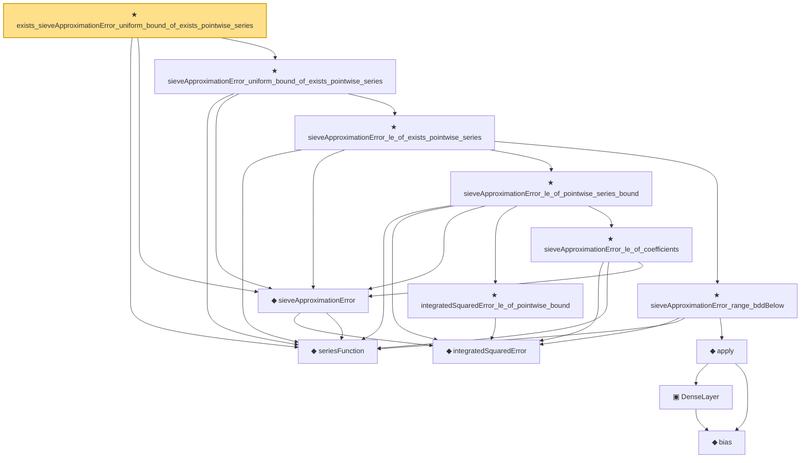

# Proof narrative — exists_sieveApproximationError_uniform_bound_of_exists_pointwise_series

Root: **exists_sieveApproximationError_uniform_bound_of_exists_pointwise_series** (theorem) `Statlib/Nonparametric/Approximation/Sieve.lean:302` · topic `Nonparametric`
Closure: 13 declarations across 6 files. Generated from `proof_graph.json` — no files were moved.

Reading order (foundations first, headline last):

  ◆ `seriesFunction` — noncomputable def · `Statlib/Nonparametric/Vocabulary/Sieve.lean:27`  _(also used by 33: holder_selectorIndicator_series_pointwise_bound, holder_selectorIndicator_series_integratedSquaredError_bound, finiteLinearSpan_classApproximationError_le_of_holder_selector_net, …)_
    ◆ `integratedSquaredError` — noncomputable def · `Statlib/Nonparametric/Vocabulary/Risk.lean:60`  _(also used by 30: supNormBall_classApproximationError_self_le_zero, holder_net_integratedSquaredError_bound, holder_classApproximationError_le_of_net_member, …)_
  ◆ `sieveApproximationError` — noncomputable def · `Statlib/Nonparametric/Vocabulary/Sieve.lean:42`  _(also used by 22: sieveApproximationError_le_of_holder_selector_net, holderBall_selectorIndicator_sieveApproximationError_uniform_bound, exists_selectorIndicatorSieve_for_holderBall_of_finite_net, …)_
        ★ `integratedSquaredError_le_of_pointwise_bound` — theorem · `Statlib/Nonparametric/Approximation/Metric.lean:10`  _(also used by 11: holder_net_integratedSquaredError_bound, holder_classApproximationError_le_of_net_member, holder_selectorIndicator_series_integratedSquaredError_bound, …)_
        ★ `sieveApproximationError_le_of_coefficients` — theorem · `Statlib/Nonparametric/Approximation/Sieve.lean:107`
      ★ `sieveApproximationError_le_of_pointwise_series_bound` — theorem · `Statlib/Nonparametric/Approximation/Sieve.lean:248`  _(also used by 1: sieveApproximationError_le_of_holder_selector_net)_
          ◆ `bias` — noncomputable def · `Statlib/Nonparametric/Vocabulary/Estimator.lean:28`
          ▣ `DenseLayer` — structure · `Statlib/Nonparametric/Vocabulary/NeuralNetwork.lean:23`  _(also used by 2: reluApply, OneHiddenReLUNet)_
        ◆ `apply` — noncomputable def · `Statlib/Nonparametric/Vocabulary/NeuralNetwork.lean:30`  _(also used by 12: unitCube_grid_finite_measurable_cover, kernel_holder_bias_integratedSquaredError_bound, classApproximationError_le_of_exists_pointwise_bound, …)_
      ★ `sieveApproximationError_range_bddBelow` — theorem · `Statlib/Nonparametric/Approximation/Sieve.lean:121`
    ★ `sieveApproximationError_le_of_exists_pointwise_series` — theorem · `Statlib/Nonparametric/Approximation/Sieve.lean:269`
  ★ `sieveApproximationError_uniform_bound_of_exists_pointwise_series` — theorem · `Statlib/Nonparametric/Approximation/Sieve.lean:285`  _(also used by 3: holderBall_selectorIndicator_sieveApproximationError_uniform_bound, tensorProductSplineSieve_holderSmoothBall_error_bound_of_exists_pointwise_series, waveletSieve_holderSmoothBall_error_bound_of_exists_pointwise_series)_
★ `exists_sieveApproximationError_uniform_bound_of_exists_pointwise_series` — theorem · `Statlib/Nonparametric/Approximation/Sieve.lean:302` **← headline**

## Dependency diagram

