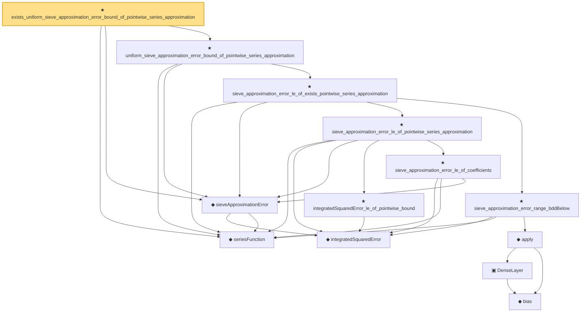

# Proof narrative — exists_uniform_sieve_approximation_error_bound_of_pointwise_series_approximation

Root: **exists_uniform_sieve_approximation_error_bound_of_pointwise_series_approximation** (theorem) `Statlib/Nonparametric/Approximation/Sieve.lean:360` · topic `Nonparametric`
Closure: 13 declarations across 6 files. Generated from `proof_graph.json` — no files were moved.

Reading order (foundations first, headline last):

  ◆ `seriesFunction` — noncomputable def · `Statlib/Nonparametric/Vocabulary/Sieve.lean:27`  _(also used by 62: selector_indicator_holder_series_pointwise_approximation_bound, selector_indicator_holder_series_integrated_squared_error_bound, selector_indicator_holder_class_approximation_error_le_of_net, …)_
    ◆ `integratedSquaredError` — noncomputable def · `Statlib/Nonparametric/Vocabulary/Risk.lean:60`  _(also used by 30: supNormBall_classApproximationError_self_le_zero, holder_net_integrated_squared_error_bound, holder_class_approximation_error_le_of_net_member, …)_
  ◆ `sieveApproximationError` — noncomputable def · `Statlib/Nonparametric/Vocabulary/Sieve.lean:42`  _(also used by 56: selector_indicator_holder_sieve_approximation_error_le_of_net, selector_indicator_uniform_sieve_holder_approximation_bound, exists_selector_indicator_sieve_holder_approximation_bound_of_finite_net, …)_
        ★ `integratedSquaredError_le_of_pointwise_bound` — theorem · `Statlib/Nonparametric/Approximation/Metric.lean:10`  _(also used by 11: holder_net_integrated_squared_error_bound, holder_class_approximation_error_le_of_net_member, selector_indicator_holder_series_integrated_squared_error_bound, …)_
        ★ `sieve_approximation_error_le_of_coefficients` — theorem · `Statlib/Nonparametric/Approximation/Sieve.lean:165`
      ★ `sieve_approximation_error_le_of_pointwise_series_approximation` — theorem · `Statlib/Nonparametric/Approximation/Sieve.lean:306`  _(also used by 3: selector_indicator_holder_sieve_approximation_error_le_of_net, unit_cube_bspline_sieve_approximation_error_bound_of_local_error, unit_cube_bspline_trace_uniform_sieve_holder_smooth_approximation_rate_of_projection)_
          ◆ `bias` — noncomputable def · `Statlib/Nonparametric/Vocabulary/Estimator.lean:28`  _(also used by 24: exists_fullyConnectedReLUNet_mul_approx_on_box, exists_fullyConnectedReLUNet_linear_combination_two, exists_fullyConnectedReLUNet_coordinate_mul_approx_on_box, …)_
          ▣ `DenseLayer` — structure · `Statlib/Nonparametric/Vocabulary/NeuralNetwork.lean:23`  _(also used by 16: exists_fullyConnectedReLUNet_finite_linear_combination_approx, exists_fullyConnectedReLUNet_product_of_depth_one_approximants_on_box, exists_fullyConnectedReLUNet_finite_centered_monomial_polynomial_approx_on_box, …)_
        ◆ `apply` — noncomputable def · `Statlib/Nonparametric/Vocabulary/NeuralNetwork.lean:30`  _(also used by 79: unit_cube_grid_finite_measurable_cover, kernel_holder_bias_integratedSquaredError_bound, classApproximationError_le_of_exists_pointwise_bound, …)_
      ★ `sieve_approximation_error_range_bddBelow` — theorem · `Statlib/Nonparametric/Approximation/Sieve.lean:179`  _(also used by 2: unit_cube_bspline_sieve_approximation_error_bound_of_local_error, unit_cube_bspline_trace_uniform_sieve_holder_smooth_approximation_rate_of_projection)_
    ★ `sieve_approximation_error_le_of_exists_pointwise_series_approximation` — theorem · `Statlib/Nonparametric/Approximation/Sieve.lean:327`
  ★ `uniform_sieve_approximation_error_bound_of_pointwise_series_approximation` — theorem · `Statlib/Nonparametric/Approximation/Sieve.lean:343`  _(also used by 3: selector_indicator_uniform_sieve_holder_approximation_bound, tensor_product_spline_sieve_holder_smooth_approximation_bound_of_exists_pointwise_series, wavelet_sieve_holder_smooth_approximation_bound_of_exists_pointwise_series)_
★ `exists_uniform_sieve_approximation_error_bound_of_pointwise_series_approximation` — theorem · `Statlib/Nonparametric/Approximation/Sieve.lean:360` **← headline**

## Dependency diagram

